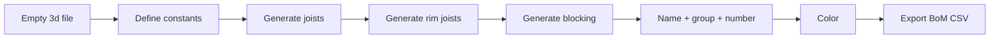
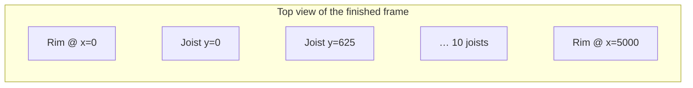

# Capstone — Build a Timber Frame from Scratch

This is the **integrative end-of-workshop exercise**. It combines everything you have learned: defining geometry from parameters, creating new elements, modifying attributes, coloring for visual feedback, and exporting a Bill of Materials.

You will start with an **empty** cadwork 3d file and end with a complete timber-framed floor — rim joists, joists, blocking, named, numbered, colored, plus a BoM CSV next to your model file.

!!! info "Setup"
    1. Open cadwork 3d and create a **new, empty** 3d file (`File → New`).
    2. Save it once so it has a path on disk (the BoM export needs that path).
    3. No selection, no model download, no template — your script will create every element from scratch.

## The brief

Write **one** script `frame_generator.py` that does all of the following, in order:

1. **Define** the frame dimensions and cross-sections as constants at the top of the script.
2. **Generate** joists along the X axis, spaced at 625 mm center-to-center.
3. **Generate** two rim joists along the Y axis that cap the ends of the joist array.
4. **Generate** blocking at the midpoint of each joist bay.
5. **Name** every element (`Joist`, `Rim Joist`, `Blocking`) and assign group `"Slab"`, subgroup `"Structure"`.
6. **Number** joists sequentially: `J-001`, `J-002`, … stored in user attribute 1.
7. **Color** joists red, rim joists green, blocking blue.
8. **Export** a CSV bill of materials next to the model file: columns `Name`, `Count`, `Total Length (m)`, `Total Volume (m³)`.





## Constants to use

```python
JOIST_LENGTH   = 5000.0   # mm, span of each joist along X
JOIST_COUNT    = 10       # number of joists
JOIST_SPACING  = 625.0    # mm, center-to-center along Y
JOIST_WIDTH    = 60.0     # mm
JOIST_HEIGHT   = 240.0    # mm

COLOR_JOIST    = 3        # red
COLOR_RIM      = 4        # green
COLOR_BLOCKING = 5        # blue
```

Everything else is derived from these — no magic numbers in the body of the script.

## Build it incrementally

Don't try to write the whole script at once. Build it in **stages**, running each stage to verify before moving on. The visualization step in each stage is your safety net.

??? example "Stage 1 — Generate joists"
    Joists run along X from `(0, y, 0)` to `(LENGTH, y, 0)`. The Y position is `i * SPACING` for joist `i`.

    ```python
    import cadwork as cw
    import element_controller as ec
    import attribute_controller as ac

    JOIST_LENGTH  = 5000.0
    JOIST_COUNT   = 10
    JOIST_SPACING = 625.0
    JOIST_WIDTH   = 60.0
    JOIST_HEIGHT  = 240.0

    x_direction = cw.point_3d(1, 0, 0)
    joist_ids = []

    for i in range(JOIST_COUNT):
        p1 = cw.point_3d(0, i * JOIST_SPACING, 0)
        new_id = ec.create_rectangular_beam_vectors(
            JOIST_WIDTH, JOIST_HEIGHT, JOIST_LENGTH, p1, x_direction
        )
        ac.set_name([new_id], "Joist")
        joist_ids.append(new_id)

    print(f"Generated {len(joist_ids)} joists")
    ```

    Run this. You should see 10 parallel beams in the viewport.

??? example "Stage 2 — Generate the two rim joists"
    Rim joists run along Y at `x = 0` and `x = JOIST_LENGTH`. They extend from `y = -WIDTH/2` to `y = (COUNT-1) * SPACING + WIDTH/2` so they cap the outer faces of the first and last joist.

    ```python
    y_direction = cw.point_3d(0, 1, 0)
    rim_start_y = -JOIST_WIDTH / 2
    rim_length  = (JOIST_COUNT - 1) * JOIST_SPACING + JOIST_WIDTH

    rim_ids = []
    for x in (0.0, JOIST_LENGTH):
        p1 = cw.point_3d(x, rim_start_y, 0)
        new_id = ec.create_rectangular_beam_vectors(
            JOIST_WIDTH, JOIST_HEIGHT, rim_length, p1, y_direction
        )
        ac.set_name([new_id], "Rim Joist")
        rim_ids.append(new_id)

    print(f"Generated {len(rim_ids)} rim joists")
    ```

??? example "Stage 3 — Blocking at mid-span"
    Blocking runs along Y between adjacent joists at `x = JOIST_LENGTH / 2`. Each block fills the clear space between joist faces: from `i * SPACING + WIDTH/2` to `(i+1) * SPACING - WIDTH/2`.

    ```python
    mid_x = JOIST_LENGTH / 2
    block_length = JOIST_SPACING - JOIST_WIDTH
    blocking_ids = []

    for i in range(JOIST_COUNT - 1):
        y_start = i * JOIST_SPACING + JOIST_WIDTH / 2
        p1 = cw.point_3d(mid_x, y_start, 0)
        new_id = ec.create_rectangular_beam_vectors(
            JOIST_WIDTH, JOIST_HEIGHT, block_length, p1, y_direction
        )
        ac.set_name([new_id], "Blocking")
        blocking_ids.append(new_id)

    print(f"Generated {len(blocking_ids)} blocking elements")
    ```

??? example "Stage 4 — Group, subgroup, sequential numbering"
    ```python
    all_new = joist_ids + rim_ids + blocking_ids
    for eid in all_new:
        ac.set_group([eid], "Slab")
        ac.set_subgroup([eid], "Structure")

    for i, eid in enumerate(joist_ids, start=1):
        ac.set_user_attribute([eid], 1, f"J-{i:03d}")
    ```

??? example "Stage 5 — Color"
    ```python
    import visualization_controller as vc

    COLOR_JOIST    = 3
    COLOR_RIM      = 4
    COLOR_BLOCKING = 5

    vc.set_color(joist_ids,    COLOR_JOIST)
    vc.set_color(rim_ids,      COLOR_RIM)
    vc.set_color(blocking_ids, COLOR_BLOCKING)
    ```

    Run this and look at the viewport — the frame should be lit up in three colors. If something is the wrong color, you have a bug in an earlier stage's ID list.

??? example "Stage 6 — Bill of Materials CSV"
    ```python
    import csv, os
    import geometry_controller as gc
    import utility_controller as uc

    groups = {
        "Joist":     joist_ids,
        "Rim Joist": rim_ids,
        "Blocking":  blocking_ids,
    }

    rows = []
    for name, ids in groups.items():
        total_length_mm = sum(gc.get_length(e) for e in ids)
        total_volume_mm3 = sum(
            gc.get_length(e) * gc.get_width(e) * gc.get_height(e) for e in ids
        )
        rows.append({
            "Name": name,
            "Count": len(ids),
            "Total Length (m)": round(total_length_mm / 1000, 2),
            "Total Volume (m³)": round(total_volume_mm3 / 1_000_000_000, 4),
        })

    output_path = os.path.join(uc.get_3d_file_path(), "bom.csv")
    with open(output_path, "w", newline="") as f:
        writer = csv.DictWriter(f, fieldnames=rows[0].keys())
        writer.writeheader()
        writer.writerows(rows)

    print(f"BoM exported to {output_path}")
    ```

## Full reference solution

??? success "Show full script"
    ```python
    import csv
    import os
    from pathlib import Path

    import cadwork as cw
    import element_controller as ec
    import attribute_controller as ac
    import geometry_controller as gc
    import visualization_controller as vc
    import utility_controller as uc

    # --- Parameters ---
    JOIST_LENGTH   = 5000.0
    JOIST_COUNT    = 10
    JOIST_SPACING  = 625.0
    JOIST_WIDTH    = 60.0
    JOIST_HEIGHT   = 240.0

    COLOR_JOIST    = 3
    COLOR_RIM      = 4
    COLOR_BLOCKING = 5

    x_direction = cw.point_3d(1, 0, 0)
    y_direction = cw.point_3d(0, 1, 0)

    # 1. Joists along X
    joist_ids = []
    for i in range(JOIST_COUNT):
        p1 = cw.point_3d(0, i * JOIST_SPACING, 0)
        new_id = ec.create_rectangular_beam_vectors(
            JOIST_WIDTH, JOIST_HEIGHT, JOIST_LENGTH, p1, x_direction, x_direction.cross(y_direction)
        )
        ac.set_name([new_id], "Joist")
        joist_ids.append(new_id)

    # 2. Rim joists along Y at both ends
    rim_start_y = -JOIST_WIDTH / 2
    rim_length  = (JOIST_COUNT - 1) * JOIST_SPACING + JOIST_WIDTH

    rim_ids = []
    for x in (0.0, JOIST_LENGTH):
        p1 = cw.point_3d(x, rim_start_y, 0)
        new_id = ec.create_rectangular_beam_vectors(
            JOIST_WIDTH, JOIST_HEIGHT, rim_length, p1, y_direction, y_direction.cross(x_direction)
        )
        ac.set_name([new_id], "Rim Joist")
        rim_ids.append(new_id)

    # 3. Blocking at mid-span between adjacent joists
    mid_x = JOIST_LENGTH / 2
    block_length = JOIST_SPACING - JOIST_WIDTH

    blocking_ids = []
    for i in range(JOIST_COUNT - 1):
        y_start = i * JOIST_SPACING + JOIST_WIDTH / 2
        p1 = cw.point_3d(mid_x, y_start, 0)
        new_id = ec.create_rectangular_beam_vectors(
            JOIST_WIDTH, JOIST_HEIGHT, block_length, p1, y_direction, y_direction.cross(x_direction)
        )
        ac.set_name([new_id], "Blocking")
        blocking_ids.append(new_id)

    # 4. Group, subgroup, sequential numbering
    all_new = joist_ids + rim_ids + blocking_ids
    for eid in all_new:
        ac.set_group([eid], "Slab")
        ac.set_subgroup([eid], "Structure")

    for i, eid in enumerate(joist_ids, start=1):
        ac.set_user_attribute([eid], 1, f"J-{i:03d}")

    # 5. Color
    vc.set_color(joist_ids,    COLOR_JOIST)
    vc.set_color(rim_ids,      COLOR_RIM)
    vc.set_color(blocking_ids, COLOR_BLOCKING)

    # 6. BoM CSV
    groups = {
        "Joist":     joist_ids,
        "Rim Joist": rim_ids,
        "Blocking":  blocking_ids,
    }
    rows = []
    for name, ids in groups.items():
        total_length_mm = sum(gc.get_length(e) for e in ids)
        total_volume_mm3 = sum(
            gc.get_length(e) * gc.get_width(e) * gc.get_height(e) for e in ids
        )
        rows.append({
            "Name": name,
            "Count": len(ids),
            "Total Length (m)": round(total_length_mm / 1000, 2),
            "Total Volume (m3)": round(total_volume_mm3 / 1_000_000_000, 4),
        })

    file_path = Path(uc.get_3d_file_path()).parent / "bom.csv"
    with open(file_path, "w", newline="") as f:
        writer = csv.DictWriter(f, fieldnames=rows[0].keys())
        writer.writeheader()
        writer.writerows(rows)

    print(f"Generated {len(joist_ids)} joists, {len(rim_ids)} rim joists, {len(blocking_ids)} blocking elements")
    print(f"BoM exported to {file_path}")
    ```

## Stretch goals

If you finish early, try one of these extensions:

1. **Add sheathing**: a single rectangular panel on top of the frame covering the whole footprint.
2. **Make spacing configurable**: read `JOIST_SPACING` from user input via `utility_controller.get_user_double()`.
3. **Derive `JOIST_COUNT` from a target frame width** instead of hard-coding it (e.g., fit as many joists as needed to span 6000 mm at the given spacing).
4. **Add an opening**: skip joists in a `1500 × 1500 mm` region (e.g., a stair opening) — print which joists were skipped.

!!! tip "You made it"
    If your viewport now shows a colored, named, fully numbered floor frame and a `bom.csv` sits next to your model file, congratulations — you have written your first real cadwork generator. Save this script: it is your starting point for everything you will write after the workshop.
