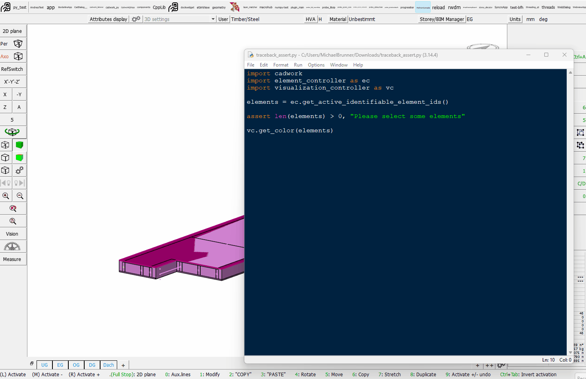

# Debugging & Common Pitfalls

Every script eventually breaks. This page is your **rescue reference** when something goes wrong — read a traceback, recognize the error, apply the fix, verify visually.

## Read the traceback bottom-up

When Python prints an error, **the last line tells you what broke**. The lines above it tell you where it broke.

```
Traceback (most recent call last):
  File "frame.py", line 12, in <module>
    p1 = gc.get_p1(eid)
  File "...", line 47, in get_p1
    raise RuntimeError("Element not found: 1042")
RuntimeError: Element not found: 1042
```

Read it like this:

1. **Last line** → `RuntimeError: Element not found: 1042` — what happened.
2. **Second-to-last block** → the API call that raised the error.
3. **First block in your file** → the line in _your_ code that triggered it (`line 12`).

Fix priority: find the line in your file that's named in the traceback. The fix is almost always there.



## Common errors and what they mean

### `AttributeError: module 'element_controller' has no attribute 'get_all_identifiable_elements'`

You **mistyped a function name**. Compare letter-by-letter against the docs or the cheat sheet. Common slips:

- `get_all_identifiable_element_ids` (correct) vs. `get_all_identifiable_elements` (missing `_ids`)
- `get_element_material_name` (correct) vs. `get_material_name`

`dir(element_controller)` in a Python prompt lists everything available.

### `TypeError: set_color() takes 2 positional arguments but 3 were given`

You passed arguments **in the wrong order or wrong count**. `set_color(ids, color)` takes two: a list of IDs and a color id. Forgetting that `ids` must be a **list** (`[eid]` not `eid`) is the #1 cause of this error in cadwork scripts.

### `IndexError: list index out of range`

You assumed a list had elements when it didn't.

```python
joists = [e for e in all_ids if ac.get_name(e) == "Joist"]
first = joists[0]   # IndexError if the model has no joists
```

Fix: check first.

```python
if not joists:
    print("No joists found")
else:
    first = joists[0]
```

### `KeyError: 'material'`

You accessed a dict key that doesn't exist. Use `.get()` with a default:

```python
beam.get("material", "unknown")
```

### Script runs but does nothing

No traceback, no output, no model change. Walk through:

1. Did you `print()` anything? If yes, where did the output go? (cadwork shows it in the console.)
2. Did you call a `set_*` function on an empty list? `set_name([], "Joist")` is a no-op.
3. Are you using the right module — did you mean `ec` (element) but type `ac` (attribute)?
4. Is anything **selected**? `get_active_identifiable_element_ids()` returns `[]` if no element is selected.

## Sanity-check checklist before asking for help

Walk through these before raising your hand:

- [ ] Is `timber-framed-elements.3d` open in cadwork 3d?
- [ ] Is the right element selected (if your script uses `get_active_…`)?
- [ ] Is the script in the right `userprofil_xxxx\3d\API.x64\my_script\` folder, with matching filename?
- [ ] Did you `import` every module you use (`ec`, `ac`, `gc`, `vc`, `uc`)?
- [ ] Did you read the **last line** of the traceback?
- [ ] Did you compare the function name against the cheat sheet?

## Workshop survival tips

!!! tip "Save before you run"
Every modification script can corrupt the model. Save the file **before** running anything that creates or deletes elements. `Ctrl+Z` works for most cadwork operations but is not always reliable for batch API changes.

!!! tip "Print early, print often"
`print(f"After filter: {len(joists)} joists")` after every major step. When something is wrong, the last successful print tells you exactly how far you got.

!!! warning "ID lifetime"
Element IDs are valid only within the current cadwork session. Never write code that assumes ID `1042` is the same element tomorrow. Always look up elements by **GUID**, not by hard-coded ID.

!!! note "Units"
cadwork's Python API uses **millimeters** for all lengths and **degrees** for some angles (depending on the function). When in doubt, print a value and check the magnitude — a beam that prints `5.0` is probably 5 mm, not 5 m.
