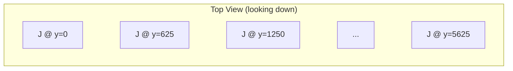
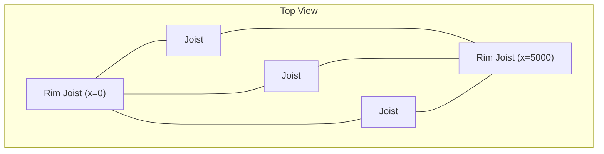
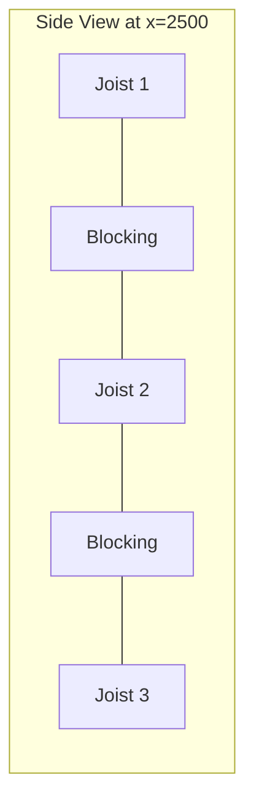

# Exercises — Creating and Modifying Elements

These exercises build on the previous ones. You will now create new elements and modify existing ones in the timber framed slab model.

!!! info "Setup"
    [Download the timber framed slab model](model-download.md) and open it in cadwork 3d before starting.

!!! warning
    These exercises modify the model. Save a copy of the original file before starting so you can reset if needed.

---

## Exercise 1: Rename Elements

Write a script that renames all elements currently named `"Beam"` to `"Joist"`.

??? success "Solution"
    ```python
    import element_controller as ec
    import attribute_controller as ac

    all_ids = ec.get_all_identifiable_element_ids()
    beams = [eid for eid in all_ids if ac.get_name(eid) == "Joist"]

    for eid in beams:
        ac.set_name([eid], "Beam")

    print(f"Renamed {len(beams)} elements")
    ```

---

## Exercise 2: Set Group and Subgroup

Write a script that sets the group to `"Slab"` and the subgroup to `"Structure"` for all joists.

??? success "Solution"
    ```python
    import element_controller as ec
    import attribute_controller as ac

    all_ids = ec.get_all_identifiable_element_ids()
    joists = [eid for eid in all_ids if ac.get_name(eid) == "Joist"]

    for eid in joists:
        ac.set_group([eid], "Slab")
        ac.set_subgroup([eid], "Structure")

    print(f"Updated {len(joists)} joists")
    ```

---

## Exercise 3: Assign Sequential Assembly Numbers

Write a script that assigns a sequential assembly number (via a user attribute) to every joist, sorted by their position along the Y-axis.

Expected result: the joist closest to Y=0 gets `"J-001"`, the next one `"J-002"`, etc.

??? example "Hint"
    Sort joists by the Y-coordinate of their P1, then use `ac.set_user_attribute()` or `ac.set_assembly_number()` with a formatted string.

??? success "Solution"
    ```python
    import element_controller as ec
    import attribute_controller as ac
    import geometry_controller as gc

    all_ids = ec.get_all_identifiable_element_ids()
    joists = [eid for eid in all_ids if ac.get_name(eid) == "Beam"]

    # Sort by X position
    joists_sorted = sorted(joists, key=lambda eid: gc.get_p1(eid).x)

    for i, eid in enumerate(joists_sorted, start=1):
        assembly_nr = f"J-{i:03d}"
        ac.set_user_attribute([eid], 1, assembly_nr) # or ac.set_assembly_number([eid], assembly_nr)
        print(f"ID {eid} -> {assembly_nr}")

    print(f"Assigned assembly numbers to {len(joists_sorted)} joists")
    ```

---

## Exercise 4: Create a Single Beam

Write a script that creates a new beam with the following properties:

- Start point: `(0, 0, 0)`
- End point: `(5000, 0, 0)`
- Width: `120 mm`
- Height: `240 mm`

After creating it, set the name to `"New Joist"`.

??? success "Solution"
    ```python
    import cadwork as cw
    import element_controller as ec
    import attribute_controller as ac

    p1 = cw.point_3d(0, 0, 0)
    p2 = cw.point_3d(5000, 0, 0)
    
    width = 120.0
    height = 240.0
    length = p2.distance(p1)
    length_direction = (p2 - p1).normalized()
    local_z_direction = cw.point_3d(0, 0, 1) # Up direction
    new_id = ec.create_rectangular_beam_vectors(width, height, length, p1, length_direction, local_z_direction)
    ac.set_name([new_id], "New Joist")

    print(f"Created element {new_id}")
    ```

---

## Exercise 5: Create a Row of Joists

Write a script that creates a row of 10 joists spaced at 625 mm center-to-center. All joists should:

- Run along the X-axis from `x=0` to `x=5000`
- Have a cross-section of `60 x 240 mm`
- Be named `"Joist"`
- Be assigned to group `"Slab"` and subgroup `"Structure"`



??? success "Solution"
    ```python
    import cadwork as cw
    import element_controller as ec
    import attribute_controller as ac

    WIDTH = 60.0
    HEIGHT = 240.0
    LENGTH = 5000.0
    SPACING = 625.0
    COUNT = 10

    created = []
    for i in range(COUNT):
        y = i * SPACING
        p1 = cw.point_3d(0, y, 0)
        p2 = cw.point_3d(LENGTH, y, 0)
        length = p2.distance(p1)
        length_direction = (p2 - p1).normalized()
        local_z_direction = cw.point_3d(0, 0, 1) # Up direction

        new_id = ec.create_rectangular_beam_vectors(WIDTH, HEIGHT, length, p1, length_direction, local_z_direction)
        ac.set_name([new_id], "Joist")
        ac.set_group([new_id], "Slab")
        ac.set_subgroup([new_id], "Structure")
        created.append(new_id)

    print(f"Created {len(created)} joists")
    ```

---

## Exercise 6: Add Rim Joists

Extend the joist row from Exercise 5 by adding two rim joists that cap the ends of the row. The rim joists should:

- Run along the Y-axis, perpendicular to the joists
- Span from the first joist to the last joist (including half the joist width on each side)
- Have a cross-section of `60 x 240 mm`
- Be named `"Rim Joist"`



??? example "Hint"
    The rim joists run along Y. Calculate the Y-span from `(-WIDTH/2)` to `((COUNT-1) * SPACING + WIDTH/2)` to cover the outer edges of the first and last joist.

??? success "Solution"
    ```python
    import cadwork as cw
    import element_controller as ec
    import attribute_controller as ac

    WIDTH = 60.0
    HEIGHT = 240.0
    SPACING = 625.0
    COUNT = 10
    LENGTH = 5000.0

    y_start = -WIDTH / 2
    y_end = (COUNT - 1) * SPACING + WIDTH / 2

    # Rim joist at x=0
    p1 = cw.point_3d(0, y_start, 0)
    p2 = cw.point_3d(0, y_end, 0)
    length = p2.distance(p1)
    length_direction = (p2 - p1).normalized()
    local_z_direction = cw.point_3d(0, 0, 1) # Up direction
    rim1 = ec.create_rectangular_beam_vectors(WIDTH, HEIGHT, length, p1, length_direction, local_z_direction)
    ac.set_name([rim1], "Rim Joist")

    # Rim joist at x=LENGTH
    p1 = cw.point_3d(LENGTH, y_start, 0)
    p2 = cw.point_3d(LENGTH, y_end, 0)
    length = p2.distance(p1)
    length_direction = (p2 - p1).normalized()
    local_z_direction = cw.point_3d(0, 0, 1) # Up direction
    rim2 = ec.create_rectangular_beam_vectors(WIDTH, HEIGHT, length, p1, length_direction, local_z_direction)
    ac.set_name([rim2], "Rim Joist")

    print(f"Created rim joists: {rim1}, {rim2}")
    ```

---

## Exercise 7: Add Blocking Between Joists

Write a script that adds blocking (short cross members) at the midpoint of each joist span. Each blocking element should:

- Run along the Y-axis between two adjacent joists
- Be placed at `x = 2500` (midpoint of a 5000 mm span)
- Have a cross-section of `60 x 240 mm`
- Be named `"Blocking"`



??? success "Solution"
    ```python
    import cadwork as cw
    import element_controller as ec
    import attribute_controller as ac

    WIDTH = 60.0
    HEIGHT = 240.0
    SPACING = 625.0
    COUNT = 10
    MID_X = 2500.0

    created = []
    for i in range(COUNT - 1):
        y_start = i * SPACING + WIDTH / 2
        y_end = (i + 1) * SPACING - WIDTH / 2

        p1 = cw.point_3d(MID_X, y_start, 0)
        p2 = cw.point_3d(MID_X, y_end, 0)
        length = p2.distance(p1)
        length_direction = (p2 - p1).normalized()
        local_z_direction = cw.point_3d(0, 0, 1) # Up direction

        new_id = ec.create_rectangular_beam_vectors(WIDTH, HEIGHT, length, p1, length_direction, local_z_direction)
        ac.set_name([new_id], "Blocking")
        ac.set_group([new_id], "Slab")
        ac.set_subgroup([new_id], "Structure")
        created.append(new_id)

    print(f"Created {len(created)} blocking elements")
    ```

---

## Exercise 8: Modify Cross-Sections

Write a script that changes the width of all elements named `"Joist"` from `60 mm` to `80 mm`.

??? example "Hint"
    Use `gc.set_width_real()` to modify the cross-section of an existing element.

??? success "Solution"
    ```python
    import element_controller as ec
    import geometry_controller as gc
    import attribute_controller as ac

    all_ids = ec.get_all_identifiable_element_ids()
    joists = [eid for eid in all_ids if ac.get_name(eid) == "Joist"]

    for eid in joists:
        gc.set_width_real([eid], 80.0)

    print(f"Updated width for {len(joists)} joists")
    ```

---

## Exercise 9: Duplicate and Offset a Slab

Write a script that duplicates all elements in the model and moves the copies up by `3000 mm` along the Z-axis. This simulates creating a second floor.

??? example "Hint"
    Use `ec.copy_elements()` and `ec.move_element()` with a Z-offset vector.

??? success "Solution"
    ```python
    import cadwork as cw
    import element_controller as ec

    all_ids = ec.get_all_identifiable_element_ids()
    offset = cw.point_3d(0, 0, 3000)

    copied_ids = ec.copy_elements(all_ids, offset)
    # or copy and then ec.move_element(copied_ids, offset)

    print(f"Duplicated {len(copied_ids)} elements, offset by Z+3000")
    ```
