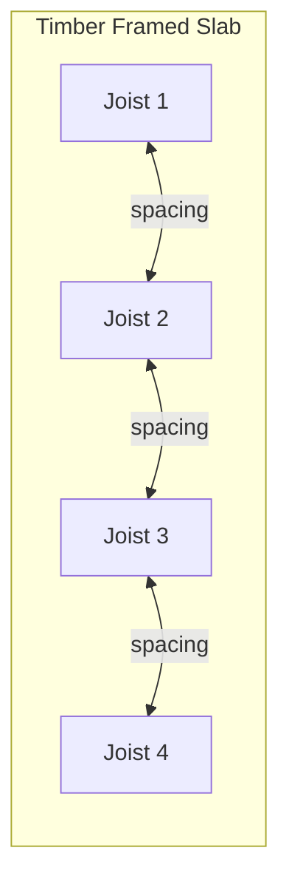

# Exercises — Geometry Data

These exercises focus on reading geometrical data from the timber framed slab model. You will work with element dimensions, positions, and volumes.

!!! info "Setup"
    [Download the timber framed slab model](model-download.md) and open it in cadwork 3d. These exercises use `element_controller`, `attribute_controller`, and `geometry_controller`.

---

## Exercise 1: Read Element Dimensions

Write a script that prints the length, width, and height of each element named `"Joist"`.

??? example "Hint"
    Use `ec.get_length()`, `ec.get_width()`, and `ec.get_height()` — these return dimensions in millimeters.

??? success "Solution"
    ```python
    import element_controller as ec
    import attribute_controller as ac
    import geometry_controller as gc

    all_ids = ec.get_all_identifiable_element_ids()
    joists = [eid for eid in all_ids if ac.get_name(eid) == "Joist"]

    for eid in joists:
        length = gc.get_length(eid)
        width = gc.get_width(eid)
        height = gc.get_height(eid)
        print(f"ID {eid}: {length:.0f} x {width:.0f} x {height:.0f} mm")
    ```

---

## Exercise 2: Calculate Total Volume

Write a script that calculates the total volume (in m³) of all elements in the model.

!!! tip
    cadwork dimensions are in millimeters. To convert mm³ to m³, divide by `1e9`.

??? success "Solution"
    ```python
    import element_controller as ec
    import geometry_controller as gc

    all_ids = ec.get_all_identifiable_element_ids()
    total_volume_mm3 = sum(
        gc.get_length(eid) * gc.get_width(eid) * gc.get_height(eid)
        for eid in all_ids
    )
    total_volume_m3 = total_volume_mm3 / 1e9
    print(f"Total volume: {total_volume_m3:.3f} m³")
    ```

---

## Exercise 3: Volume per Material

Write a script that calculates the total volume (in m³) grouped by material.

Expected output format:

```
GL24h :  1.234 m³
C24   :  0.567 m³
OSB   :  0.189 m³
```

??? success "Solution"
    ```python
    import element_controller as ec
    import attribute_controller as ac
    from collections import defaultdict

    all_ids = ec.get_all_identifiable_element_ids()
    volume_by_material = defaultdict(float)

    for eid in all_ids:
        material = ac.get_material(eid)
        volume_mm3 = gc.get_length(eid) * gc.get_width(eid) * gc.get_height(eid)
        volume_by_material[material] += volume_mm3

    for material, vol in sorted(volume_by_material.items()):
        print(f"{material:12s}: {vol / 1e9:.3f} m³")

    # or without defaultdict:
    volume_by_material = {}
    for eid in all_ids:
        material = ac.get_material(eid)
        volume_mm3 = gc.get_length(eid) * gc.get_width(eid) * gc.get_height(eid)
        volume_by_material[material] = volume_by_material.get(material, 0) + volume_mm3
    for material, vol in sorted(volume_by_material.items()):
        print(f"{material:12s}: {vol / 1e9:.3f} m³")
    ```

---

## Exercise 4: Find the Longest Element

Write a script that finds the element with the greatest length and prints its ID, name, and length.

??? success "Solution"
    ```python
    import element_controller as ec
    import geometry_controller as gc
    import attribute_controller as ac

    all_ids = ec.get_all_identifiable_element_ids()
    longest_id = max(all_ids, key=lambda eid: gc.get_length(eid))

    print(
        f"Longest element: ID {longest_id}, "
        f"Name: {ac.get_name(longest_id)}, "
        f"Length: {gc.get_length(longest_id):.0f} mm"
    )
    ```

---

## Exercise 5: Element Start and End Points

Write a script that prints the start point (P1) and end point (P2) of every joist. Use `geometry_controller` to access the local coordinate system.

??? example "Hint"
    Use `gc.get_p1(eid)` and `gc.get_p2(eid)` which return `point_3d` objects with `.x`, `.y`, `.z` attributes.

??? success "Solution"
    ```python
    import element_controller as ec
    import attribute_controller as ac
    import geometry_controller as gc

    all_ids = ec.get_all_identifiable_element_ids()
    joists = [eid for eid in all_ids if ac.get_name(eid) == "Joist"]

    for eid in joists:
        p1 = gc.get_p1(eid)
        p2 = gc.get_p2(eid)
        print(
            f"ID {eid}: "
            f"P1({p1.x:.0f}, {p1.y:.0f}, {p1.z:.0f}) -> "
            f"P2({p2.x:.0f}, {p2.y:.0f}, {p2.z:.0f})"
        )
    ```

---

## Exercise 6: Spacing Analysis

Write a script that calculates the center-to-center spacing between adjacent joists. Assume the joists run parallel along the same axis.



??? example "Hint"
    Get the P1 of each joist, sort by the coordinate perpendicular to the joist direction, then compute differences between consecutive positions. Assumption: Direction of distribution in the Y-axis, so sort by `p1.y`.

??? success "Solution"
    ```python
    import element_controller as ec
    import attribute_controller as ac
    import geometry_controller as gc

    all_ids = ec.get_all_identifiable_element_ids()
    joists = [eid for eid in all_ids if ac.get_name(eid) == "Joist"]

    # Get Y-coordinate of P1 for each joist (assuming joists run along X)
    joist_positions = []
    for eid in joists:
        p1 = gc.get_p1(eid)
        joist_positions.append((p1.y, eid))

    joist_positions.sort()

    print("Joist spacing (center-to-center):")
    for i in range(1, len(joist_positions)):
        spacing = joist_positions[i][0] - joist_positions[i - 1][0]
        print(
            f"  Joist {joist_positions[i-1][1]} -> "
            f"Joist {joist_positions[i][1]}: {spacing:.0f} mm"
        )
    ```

---

## Exercise 7: Geometry CSV Export

Extend the CSV export from the reading exercises: add columns for `Length`, `Width`, `Height`, `Volume_m3`, `P1_x`, `P1_y`, `P1_z`.

??? success "Solution"
    ```python
    import csv
    import os
    import element_controller as ec
    import attribute_controller as ac
    import geometry_controller as gc
    import utility_controller as uc

    all_ids = ec.get_all_identifiable_element_ids()
    output_path = os.path.join(uc.get_3d_file_path(), "geometry_report.csv")

    with open(output_path, "w", newline="") as f:
        writer = csv.writer(f)
        writer.writerow([
            "ID", "Name", "Material",
            "Length_mm", "Width_mm", "Height_mm", "Volume_m3",
            "P1_x", "P1_y", "P1_z",
        ])
        for eid in all_ids:
            p1 = gc.get_p1(eid)
            length = gc.get_length(eid)
            width = gc.get_width(eid)
            height = gc.get_height(eid)
            volume = (length * width * height) / 1e9
            writer.writerow([
                eid,
                ac.get_name(eid),
                ac.get_material(eid),
                f"{length:.0f}",
                f"{width:.0f}",
                f"{height:.0f}",
                f"{volume:.4f}",
                f"{p1.x:.1f}",
                f"{p1.y:.1f}",
                f"{p1.z:.1f}",
            ])

    print(f"Exported {len(all_ids)} elements to {output_path}")
    ```
