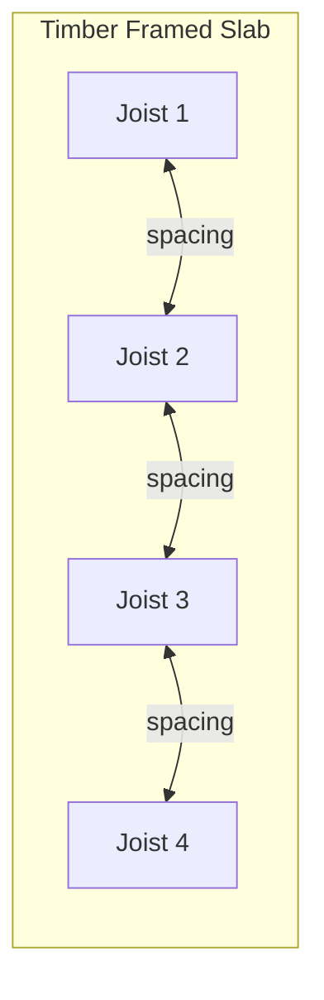
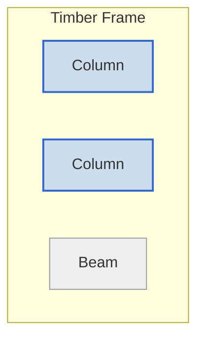

# Exercises — Geometry Data

These exercises focus on reading geometrical data from the timber framed slab model. You will work with element dimensions, positions, and volumes.

!!! info "Setup"
    [Download the timber framed slab model](model-download.md) and open it in cadwork 3d. These exercises use `element_controller`, `attribute_controller`, and `geometry_controller`.

---

## Exercise 1: Read Element Dimensions

Write a script that prints the length, width, and height of each element named `"Joist"`.

??? example "Hint"
    Use `ec.get_length()`, `ec.get_width()`, and `ec.get_height()` — these return dimensions in millimeters.

??? success "Solution"
    ```python
    import element_controller as ec
    import attribute_controller as ac
    import geometry_controller as gc

    all_ids = ec.get_all_identifiable_element_ids()
    joists = [eid for eid in all_ids if ac.get_name(eid) == "Joist"]

    for eid in joists:
        length = gc.get_length(eid)
        width = gc.get_width(eid)
        height = gc.get_height(eid)
        print(f"ID {eid}: {length:.0f} x {width:.0f} x {height:.0f} mm")
    ```

---

## Exercise 2: Calculate Total Volume

Write a script that calculates the total volume (in m³) of all elements in the model.

!!! tip
    cadwork dimensions are in millimeters. To convert mm³ to m³, divide by `1e9`.

??? success "Solution"
    ```python
    import element_controller as ec
    import geometry_controller as gc

    all_ids = ec.get_all_identifiable_element_ids()
    total_volume_mm3 = sum(
        gc.get_length(eid) * gc.get_width(eid) * gc.get_height(eid)
        for eid in all_ids
    )
    total_volume_m3 = total_volume_mm3 / 1e9
    print(f"Total volume: {total_volume_m3:.3f} m³")
    ```

---

## Exercise 3: Volume per Material

Write a script that calculates the total volume (in m³) grouped by material.

Expected output format:

```
GL24h :  1.234 m³
C24   :  0.567 m³
OSB   :  0.189 m³
```

??? success "Solution"
    ```python
    import element_controller as ec
    import attribute_controller as ac
    import geometry_controller as gc
    from collections import defaultdict

    all_ids = ec.get_all_identifiable_element_ids()
    volume_by_material = defaultdict(float)

    for eid in all_ids:
        material = ac.get_element_material_name(eid)
        volume_mm3 = gc.get_length(eid) * gc.get_width(eid) * gc.get_height(eid)
        volume_by_material[material] += volume_mm3

    for material, vol in sorted(volume_by_material.items()):
        print(f"{material:25s}: {vol / 1e9:.3f} m³")

    # or without defaultdict:
    volume_by_material = {}
    for eid in all_ids:
        material = ac.get_element_material_name(eid)
        volume_mm3 = gc.get_length(eid) * gc.get_width(eid) * gc.get_height(eid)
        volume_by_material[material] = volume_by_material.get(material, 0) + volume_mm3
    for material, vol in sorted(volume_by_material.items()):
        print(f"{material:25s}: {vol / 1e9:.3f} m³")
    ```

---

## Exercise 4: Find the Longest Element

Write a script that finds the element with the greatest length and prints its ID, name, and length.

??? success "Solution"
    ```python
    import element_controller as ec
    import geometry_controller as gc
    import attribute_controller as ac

    all_ids = ec.get_all_identifiable_element_ids()
    longest_id = max(all_ids, key=lambda eid: gc.get_length(eid))

    print(
        f"Longest element: ID {longest_id}, "
        f"Name: {ac.get_name(longest_id)}, "
        f"Length: {gc.get_length(longest_id):.0f} mm"
    )
    ```

---

## Exercise 5: Element Start and End Points

Write a script that prints the start point (P1) and end point (P2) of every joist. Use `geometry_controller` to access the local coordinate system.

??? example "Hint"
    Use `gc.get_p1(eid)` and `gc.get_p2(eid)` which return `point_3d` objects with `.x`, `.y`, `.z` attributes.

??? success "Solution"
    ```python
    import element_controller as ec
    import attribute_controller as ac
    import geometry_controller as gc

    all_ids = ec.get_all_identifiable_element_ids()
    joists = [eid for eid in all_ids if ac.get_name(eid) == "Joist"]

    for eid in joists:
        p1 = gc.get_p1(eid)
        p2 = gc.get_p2(eid)
        print(
            f"ID {eid}: "
            f"P1({p1.x:.0f}, {p1.y:.0f}, {p1.z:.0f}) -> "
            f"P2({p2.x:.0f}, {p2.y:.0f}, {p2.z:.0f})"
        )
    ```

---

## Exercise 6: Spacing Analysis

Write a script that calculates the center-to-center spacing between adjacent joists. Assume the joists run parallel along the same axis.


```mermaid
flowchart LR
    subgraph Timber Framed Slab
        J1["Joist 1"] ~~~ J2["Joist 2"] ~~~ J3["Joist 3"] ~~~ J4["Joist 4"]
    end
    J1 <-->|"spacing"| J2
    J2 <-->|"spacing"| J3
    J3 <-->|"spacing"| J4
```

??? example "Hint"
    Get the P1 of each joist, sort by the coordinate perpendicular to the joist direction, then compute differences between consecutive positions. Assumption: Direction of distribution in the Y-axis, so sort by `p1.y`.

??? success "Solution"
    ```python
    import element_controller as ec
    import attribute_controller as ac
    import geometry_controller as gc

    all_ids = ec.get_active_identifiable_element_ids() # Select all joists of the slab/floor element
    joists = [eid for eid in all_ids if ac.get_name(eid) == "Joist"]

    # Get X-coordinate of P1 for each joist (assuming joists run along Y)
    joist_positions: list[tuple[float, int]] = []
    for eid in joists:
        p1 = gc.get_p1(eid)
        joist_positions.append((p1.x, eid))

    joist_positions.sort()

    print("Joist spacing (center-to-center):")
    for i in range(1, len(joist_positions)):
        spacing = joist_positions[i][0] - joist_positions[i - 1][0]
        print(
            f"  Joist {joist_positions[i-1][1]} -> "
            f"Joist {joist_positions[i][1]}: {spacing:.0f} mm"
        )
    ```

---

## Exercise 7: Geometry CSV Export

Extend the CSV export from the reading exercises: add columns for `Length`, `Width`, `Height`, `Volume_m3`, `P1_x`, `P1_y`, `P1_z`.

??? success "Solution"
    ```python
    import csv
    import os
    from pathlib import Path
    import element_controller as ec
    import attribute_controller as ac
    import geometry_controller as gc
    import utility_controller as uc

    all_ids = ec.get_all_identifiable_element_ids()
    file_path = Path(uc.get_3d_file_path()).parent
    output_path = file_path / "geometry_report.csv"

    with open(output_path, "w", newline="") as f:
        writer = csv.writer(f)
        writer.writerow([
            "ID", "Name", "Material",
            "Length_mm", "Width_mm", "Height_mm", "Volume_m3",
            "P1_x", "P1_y", "P1_z",
        ])
        for eid in all_ids:
            p1 = gc.get_p1(eid)
            length = gc.get_length(eid)
            width = gc.get_width(eid)
            height = gc.get_height(eid)
            volume = (length * width * height) / 1e9
            writer.writerow([
                eid,
                ac.get_name(eid),
                ac.get_element_material_name(eid),
                f"{length:.0f}",
                f"{width:.0f}",
                f"{height:.0f}",
                f"{volume:.4f}",
                f"{p1.x:.1f}",
                f"{p1.y:.1f}",
                f"{p1.z:.1f}",
            ])

    print(f"Exported {len(all_ids)} elements to {output_path}")
    ```

---

## Exercise 8: Identify Vertical Stud Elements (Columns)

Write a script that identifies all **vertical** stud elements in the model and prints their ID and name. A stud is vertical when its length axis runs along the global Z-axis.


```mermaid
flowchart TB
    subgraph Timber Frame
        C1["Column"]:::vert
        C2["Column"]:::vert
        B1["Beam"]:::horiz
    end
    classDef vert fill:#cde,stroke:#36c,stroke-width:2px;
    classDef horiz fill:#eee,stroke:#999;
```

??? example "Hint"
    The length axis of an element is the direction from `P1` to `P2`. Build the direction vector `(p2 - p1)`, normalize it, and check whether it is (nearly) parallel to the Z-axis — i.e. the absolute Z-component of the unit vector is close to `1.0`. Use a small tolerance to account for floating-point error and slightly tilted elements.

??? success "Solution"
    ```python
    import math
    import element_controller as ec
    import attribute_controller as ac
    import geometry_controller as gc

    def is_vertical(eid: int, tolerance: float = 1e-3) -> bool:
        p1 = gc.get_p1(eid)
        p2 = gc.get_p2(eid)
        dx, dy, dz = p2.x - p1.x, p2.y - p1.y, p2.z - p1.z
        length = math.sqrt(dx * dx + dy * dy + dz * dz)
        if length == 0:
            return False
        # Z-component of the unit direction vector; ~1.0 means parallel to Z
        return abs(dz / length) > 1.0 - tolerance

    all_ids = ec.get_all_identifiable_element_ids()
    columns = [eid for eid in all_ids if is_vertical(eid)]

    print(f"Found {len(columns)} vertical stud element(s):")
    for eid in columns:
        print(f"  ID {eid}: {ac.get_name(eid)}")
    ```

!!! tip "Going further"
    `geometry_controller` also exposes the local axes directly via `gc.get_xl(eid)` (the length axis as a `point_3d`). You can use `abs(gc.get_xl(eid).z) > 1.0 - tolerance` instead of computing the direction from `P1`/`P2`.

---

## Exercise 9: Verify Beam Cross-Section (SIA / Lignum)

Verify the cross-section of the floor beams against the preliminary sizing rule from the **Lignum wood construction tables** (*Lignum Holzbautabellen*), consistent with the serviceability limits of **SIA 265**.

The workflow:

1. Identify the beams **by name** (e.g. `"Joist"`).
2. Restrict them to the beams that **belong to the subgroup** of the floor element — use `attribute_controller.get_subgroup()`.
3. **Determine the span length** of each beam (distance from `P1` to `P2`).
4. Compare the existing height `h` against the required height and report the cross-sectional area `A` and section modulus `W`.

!!! info "Preliminary sizing rule (Vordimensionierung)"
    For solid-timber floor joists under residential loading, the Lignum tables give a deflection-governed rule of thumb of roughly **h ≈ L/17 … L/20**. This exercise uses the conservative bound **h ≥ L/17** as the pass criterion. This is a *preliminary* check — a full SIA 265 verification (bending, shear, and serviceability) additionally requires the design loads, the strength class, and the modification factors.

??? example "Hint"
    - Filter with two conditions: `ac.get_name(eid) == "Joist"` **and** `ac.get_subgroup(eid) == "<floor subgroup>"`.
    - The span (system length) is the `P1`→`P2` distance; `math.dist((p1.x, p1.y, p1.z), (p2.x, p2.y, p2.z))` is the simplest way.
    - Cross-sectional area `A = b · h`; section modulus `W = b · h² / 6`. Watch the units: cadwork works in mm, so divide by `100` for cm² and by `1000` for cm³.

??? success "Solution"
    ```python
    import math
    import element_controller as ec
    import attribute_controller as ac
    import geometry_controller as gc

    # --- configuration: adjust to match your model ---
    BEAM_NAME = "Joist"
    FLOOR_SUBGROUP = "Floor"        # subgroup the floor element's beams belong to
    SPAN_TO_HEIGHT_RATIO = 17       # Lignum rule for residential floors: h >= L / 17

    def span_length(eid: int) -> float:
        p1 = gc.get_p1(eid)
        p2 = gc.get_p2(eid)
        return math.dist((p1.x, p1.y, p1.z), (p2.x, p2.y, p2.z))

    all_ids = ec.get_all_identifiable_element_ids()
    beams = [
        eid for eid in all_ids
        if ac.get_name(eid) == BEAM_NAME and ac.get_subgroup(eid) == FLOOR_SUBGROUP
    ]

    print(f"Verifying {len(beams)} '{BEAM_NAME}' beam(s) in subgroup '{FLOOR_SUBGROUP}':")
    print(
        f"{'ID':>6} {'L [mm]':>9} {'b [mm]':>7} {'h [mm]':>7} "
        f"{'h_req [mm]':>11} {'A [cm2]':>9} {'W [cm3]':>9}  Check"
    )

    for eid in beams:
        L = span_length(eid)
        b = gc.get_width(eid)
        h = gc.get_height(eid)
        h_req = L / SPAN_TO_HEIGHT_RATIO
        area_cm2 = (b * h) / 100.0                  # mm² -> cm²
        section_modulus_cm3 = (b * h * h / 6.0) / 1000.0  # mm³ -> cm³
        ok = "OK" if h >= h_req else "TOO LOW"
        print(
            f"{eid:>6} {L:>9.0f} {b:>7.0f} {h:>7.0f} {h_req:>11.0f} "
            f"{area_cm2:>9.1f} {section_modulus_cm3:>9.1f}  {ok}"
        )
    ```

!!! warning "System length vs. structural span"
    The `P1`→`P2` distance is the element's system length. The structural span between supports is usually slightly shorter (bearing insets are neglected here). For a real verification, subtract the support depths or use the centre-to-centre distance of the supports.
