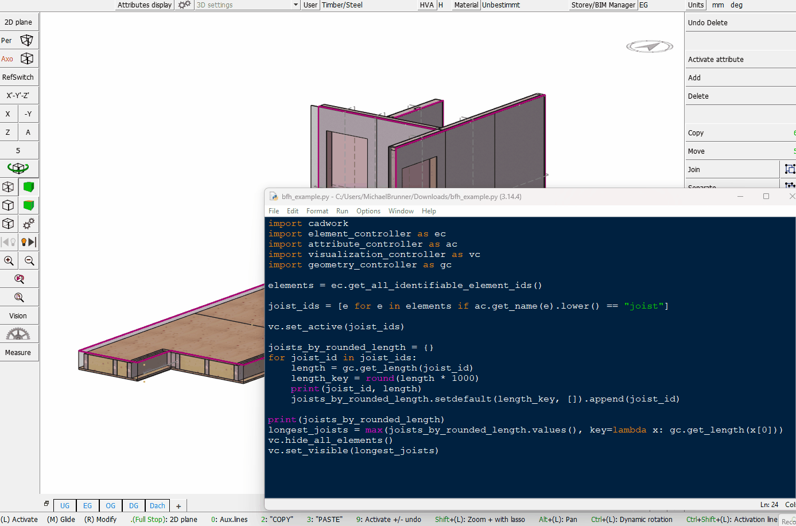
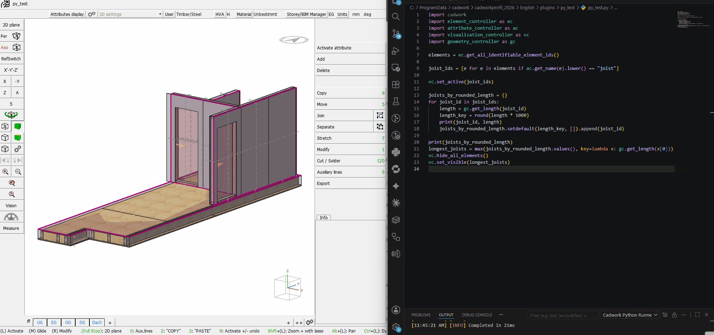
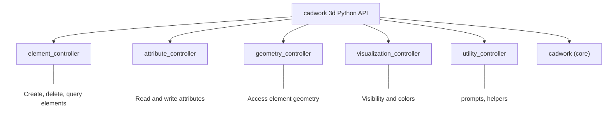

# Getting Started

This page explains how to set up and run Python scripts within cadwork 3d.

## Python in cadwork 3d

cadwork 3d includes an embedded Python interpreter. Scripts can be executed directly from within the application to automate tasks such as creating elements, modifying attributes, or generating reports.

## Running a Script

Option 1: Use the [IDLE Shell](https://docs.python.org/3/library/idle.html) (Integrated Development and Learning Environment) that comes with Python. You can write and execute your script in the IDLE editor, which provides a simple interface for running Python code.



Option 2: Save your script as a `.py` file in the `API.x64` folder of your cadwork user profile. Then, you can execute it from the plugin bar in cadwork 3d.
1. Open cadwork 3d
2. Navigate to the **Userprofil** `..\cadwork\userprofil_2026\3d\API.x64`
3. Create a folder named `my_script` and save your Python script there (`my_script.py`) The python file must hold the same name as the folder.
4. Start cadwork 3d and execute the script from the plugin bar



## First Script

A minimal cadwork Python script:

```python
import cadwork as cw
import element_controller as ec

# Get all element IDs in the model
element_ids = ec.get_all_identifiable_element_ids()
print(f"Number of elements: {len(element_ids)}")
```

## API Modules



The cadwork Python API is organized into several modules:

| Module                     | Description                             |
| -------------------------- | --------------------------------------- |
| `cadwork`                  | Core utilities and types                |
| `element_controller`       | Create, delete, and query elements      |
| `attribute_controller`     | Read and write element attributes       |
| `geometry_controller`      | Access element geometry                 |
| `visualization_controller` | Control visibility and colors           |
| `utility_controller`       | File dialogs, user prompts, and helpers |

