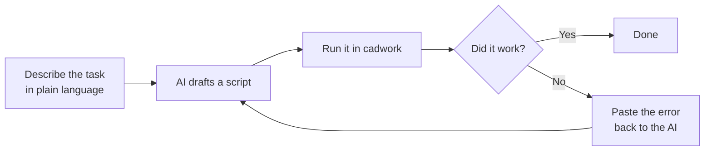
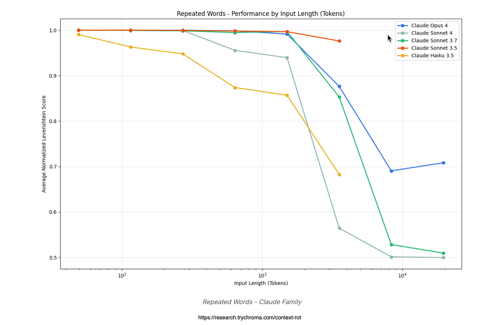
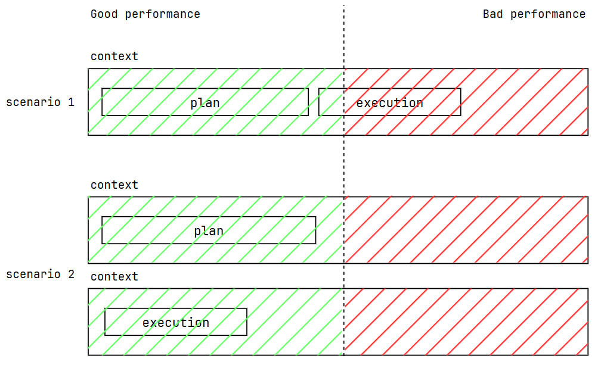
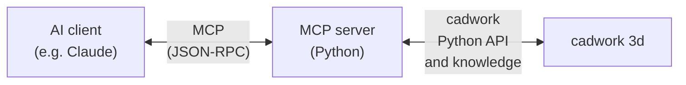

# AI-Assisted Scripting & MCP

In practice, most of the cadwork Python you will write after this workshop will be drafted with the help of an AI assistant (Claude, ChatGPT, GitHub Copilot, …). This page shows you how to do that **properly** — and what Cadwork API MCP is, for when you are ready to go deeper.

## Why use AI to write cadwork scripts

Writing a cadwork script is two jobs in one.

You are already good at:
- Defining the engineering problem
- Recognizing whether a result is right

You may not want to spend time on:
- Remembering every API function name
- Getting the argument order right
- Gluing three controllers into a thirty-line script

AI handles the second list. Modern models have read more of Python code and more example scripts than any one engineer ever will. **You** stay in charge of the first.

> Think of the AI as a fluent coder who knows the API cold but has never seen your project. You bring the engineering intent. It writes the code. You verify it.

## The iteration loop



Three rounds is usually enough for a workshop-scale script.

Here's some rules and important tips to use these tools effectively.

## User instructions: Writing a good prompt

Bad prompt:

> Write a cadwork script that makes joists.

Good prompt:

> I have a cadwork 3d model open with a single rim joist selected. Write a Python script that:
>
> - Reads the selected rim joist's length and direction
> - Creates joists perpendicular to it, every 625 mm, with a 60×240 mm cross-section, 5000 mm long
> - Names each joist "Joist", group "Slab", subgroup "Structure"
> - Colors them red (color id 3) for visual confirmation

Optionally, if you want to be more specific about the API usage, you can add:

> Use these modules: `element_controller as ec`, `attribute_controller as ac`, `geometry_controller as gc`, `visualization_controller as vc`. `create_rectangular_beam_vectors(width, height, length, p1, xl_direction, zl_direction)` is the function for beam creation.

The good prompt:

- States the **starting condition** (what's selected, what's open)
- Lists the **steps** in order
- Defines **success** (color them so I can see it worked)
- (Optional) Names the **exact API functions and modules** to use


## Context rotting: keep it short

The AI has a limited context window (the amount of text it can "see" at once). If your conversation with the AI gets too long, its generation quality will degrade. This is called **context rotting**.



For small scripts, 3 rounds of iteration is usually enough. If you find yourself doing 10 rounds of back-and-forth with the AI, it's probably time to start a new conversation and copy-paste the working code into it.

For larger scripts, split your task in at least two:

- **plan**: produce a high-level outline of the script but no code yet
- **code**: write the actual code, referring to the plan for guidance

{width=500px}


## Reflexion: when the AI gets it wrong

Paste the **full traceback error** back into the conversation:

> ```
> Traceback (most recent call last):
>   File "frame.py", line 12, in <module>
>     ec.create_rectangular_beam_vectors(60, 240, p1, p2)
> TypeError: create_rectangular_beam_vectors() takes 6 positional arguments but 4 were given
> ```
>
> Please fix the function call. The signature is `(width, height, length, p1, xl_direction, zl_direction)`.

Give the model the error verbatim plus the correct signature. It will fix the call.
**Do not** summarize the error or say *"the error is that you forgot the length argument"*. The exact error message and signature are what the model needs to fix the code.

---

## Cadwork-specific context: Model Context Protocol (MCP)

### Quickstart

Add the following to your VS Code settings file (.vscode/mcp.json in your workspace or user settings):

1. Install the MCP server:

```bash
{
  "servers": {
    "cadwork-pyapi": {
      "type": "http",
      "url": "https://pyapi.mcp.cadwork.dev/mcp"
    }
  }
}
```
For other IDE or AI Assistatnts, refer to the MCP docs, [here](https://docs.cadwork.com/projects/cwapi3dpython/en/latest/mcp/)

### Cadwork context-aware AI assistant

Any AI has not necessarily been trained on the cadwork API, and for the AI to search documentation is still expensive in terms of time and tokens. That is why the AI can get function signatures wrong, or suggest non-existent functions.

The [Cadwork Python API Model Context Protocol (MCP)](https://docs.cadwork.com/projects/cwapi3dpython/en/latest/mcp/) injects correct Cadwork API Python function signatures and other knowledge into the AI's environment.




An MCP server exposes cadwork API knowledge as **tools** the AI can search directly. Take it as a very fast Cadwork search engine for AI.

To this day `19.05.2026`, the MCP Cadwork gives access to the following tools:

- `search_api_examples`: search for code examples by keyword
- `search_api_signatures`: search for function signatures by keyword
- `search_api_modules`: search for module contents by keyword
- `search_community_threads`: search for community forum threads by keyword

Do not worry, you don't need to use these tools, your AI agent will decide when to use them. You just need to set up the server and connect it to your AI client.

!!! hint "Use MCP to learn the API faster"
    If you are new to the API, using an MCP server can help you learn it faster. The AI will pull in the correct function signatures and examples, so you can see how to use the API in context. 
    Type prompts like `"How do I create a rectangular beam?"` and see the AI pull in the exact function signature and example code.

!!! note "MCP vs documentation"
    MCP is not a replacement for documentation. It is a **complement** that gives the AI direct access to the API knowledge it needs to write code. You still need to understand the API and read the docs to debug it effectively.

---

## Further reading

- [Model Context Protocol specification](https://modelcontextprotocol.io/)
- [Claude Code](https://claude.com/claude-code) — terminal-based AI that supports MCP servers out of the box

!!! tip "Workshop takeaway"
    Treat the AI as a fast pair-programmer who knows Python well and cadwork *roughly*. You bring the engineering judgment, the model context, and the visual verification. The AI brings the syntax and the boilerplate.
