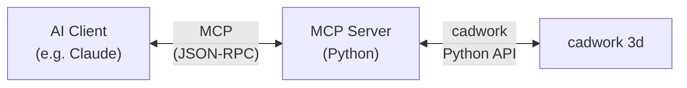

# MCP — Model Context Protocol

The Model Context Protocol (MCP) provides a standardized way for AI assistants to interact with the cadwork 3d API. It enables large language models (LLMs) to query and manipulate cadwork models through a structured tool interface.

## What is MCP?

MCP is an open protocol that defines how AI applications can connect to external tools and data sources. In the context of cadwork 3d, an MCP server exposes cadwork API functions as tools that an AI assistant can call.

This means you can use natural language to interact with your cadwork model — for example, asking an AI assistant to list all beams, change materials, or generate reports.

## Architecture

The MCP server acts as a bridge between the AI client and cadwork 3d, translating natural-language-driven tool calls into cadwork Python API calls.

## TODO

