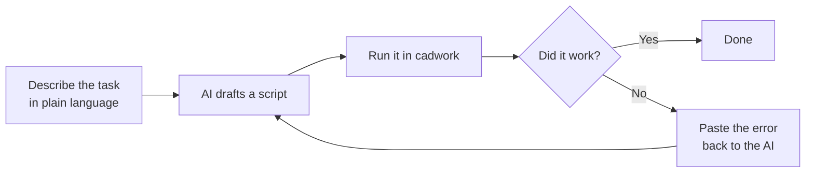
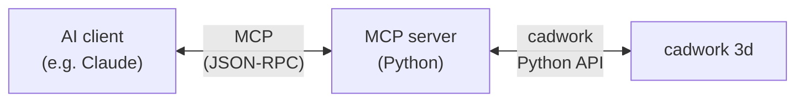

# AI-Assisted Scripting & MCP

In practice, most of the cadwork Python you will write after this workshop will be drafted with the help of an AI assistant (Claude, ChatGPT, GitHub Copilot, …). This page shows you how to do that **well** — and what MCP is, for when you are ready to go deeper.

## Why use AI to write cadwork scripts

You already know:

- What you want the script to do (the timber-engineering problem)
- How to read a result and tell if it is right

You don't necessarily remember:

- The exact name of every API function
- The right argument order
- How to combine three controllers into a 30-line script

The AI fills in the second list. **You** stay in charge of the first.

## The iteration loop



Three rounds is usually enough for a workshop-scale script.

## Writing a good prompt

Bad prompt:

> Write a cadwork script that makes joists.

Good prompt:

> I have a cadwork 3d model open with a single rim joist selected. Write a Python script that:
>
> - Reads the selected rim joist's length and direction
> - Creates joists perpendicular to it, every 625 mm, with a 60×240 mm cross-section, 5000 mm long
> - Names each joist "Joist", group "Slab", subgroup "Structure"
> - Colors them red (color id 3) for visual confirmation
>
> Use these modules: `element_controller as ec`, `attribute_controller as ac`, `geometry_controller as gc`, `visualization_controller as vc`. `create_rectangular_beam_vectors(width, height, length, p1, xl_direction, zl_direction)` is the function for beam creation.

The good prompt:

- States the **starting condition** (what's selected, what's open)
- Lists the **steps** in order
- Names the **exact API functions and modules** to use
- Defines **success** (color them so I can see it worked)

## What to verify in any AI-generated script

Treat the AI's output as a **first draft by a confident but new colleague**. Before running:

1. **Argument order** — does `create_rectangular_beam_vectors(...)` have the args in the cadwork order, not the OpenCV / numpy / blender order? The AI sometimes hallucinates plausible-looking signatures.
2. **Lists vs. single IDs** — many setters take `[eid]`, not `eid`. Check every call.
3. **Units** — cadwork is mm. The AI may default to meters for "thickness 0.04".
4. **Imports** — make sure every module used is imported.
5. **No deletions you did not ask for** — `ec.delete_elements` and `ec.copy_elements` are easy to get wrong.

Run the script with a **saved backup** of your model.

## When the AI gets it wrong

Paste the **full traceback** back into the conversation:

> ```
> Traceback (most recent call last):
>   File "frame.py", line 12, in <module>
>     ec.create_rectangular_beam_vectors(60, 240, p1, p2)
> TypeError: create_rectangular_beam_vectors() takes 6 positional arguments but 4 were given
> ```
>
> Please fix the function call. The signature is `(width, height, length, p1, xl_direction, zl_direction)`.

Give the model the error verbatim plus the correct signature. It will fix the call.

## Model Context Protocol (MCP) — the deeper layer

Everything above is **manual** AI usage: you copy, paste, run, paste back. The **Model Context Protocol** (MCP) automates that loop.



An MCP server exposes cadwork API functions as **tools** the AI can call directly:

- The AI doesn't write a `.py` file and ask you to run it.
- It calls `element_controller.get_all_identifiable_element_ids` over MCP and reads the result itself.
- It iterates without you in the loop.

For this workshop, **manual AI usage is enough** — and gives you more control. MCP becomes worth setting up when:

- You run the same task often and want it to feel like a chat command.
- You want the AI to **read** the model state before suggesting changes.
- You are building a custom tool for your team.

### Further reading

- [Model Context Protocol specification](https://modelcontextprotocol.io/)
- [Claude Code](https://claude.com/claude-code) — terminal-based AI that supports MCP servers out of the box

!!! tip "Workshop takeaway"
    Treat the AI as a fast pair-programmer who knows Python well and cadwork *roughly*. You bring the engineering judgment, the model context, and the visual verification. The AI brings the syntax and the boilerplate.
