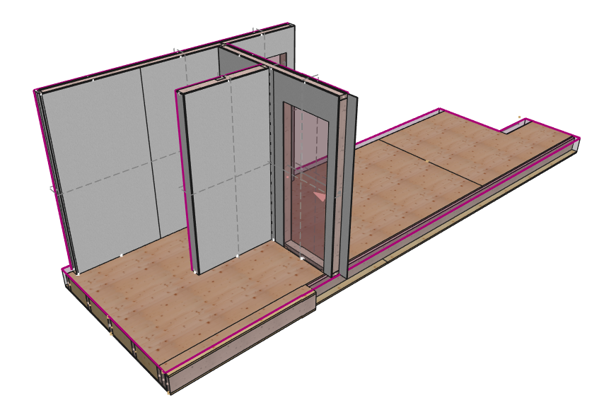

# Exercise Model — Download

All cadwork 3d API exercises on this site use the same model: a **timber framed slab** with joists, rim joists, blocking, and sheathing. Download it once, then open it in cadwork 3d before starting the exercises.

## Download

**[⬇ timber-framed-elements.3d](models/timber-framed-elements.3d){: download="timber-framed-elements.3d"}**

Timber framed slab — cadwork 3d file (open in cadwork 3d v2025 or newer)

!!! tip "How to use the file"
    1. Click the link above and save the file to your local machine.
    2. Open it in cadwork 3d (double-click the file).
    3. Keep a copy of the original — some exercises modify the model and you may want to reset.

## What's inside the model

