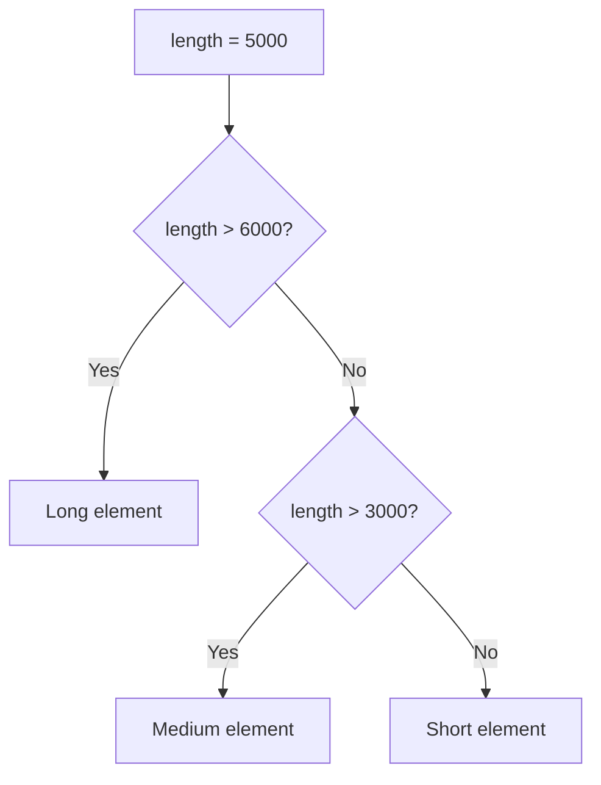
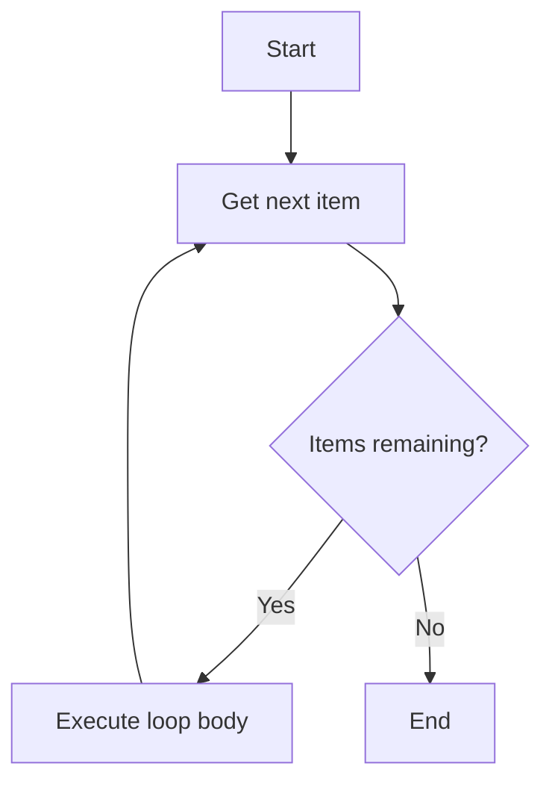

# Control Flow

Control flow statements let you execute code conditionally or repeatedly.


## If / Else



```python
length = 5000

if length > 6000:
    print("Long element")
elif length > 3000:
    print("Medium element")
else:
    print("Short element")
```

!!! question "Quick Check: Branching"
    For each value of `length`, which branch executes?

    | length | branch |
    |--------|--------|
    | 7500   | ?      |
    | 6000   | ?      |
    | 3001   | ?      |
    | 3000   | ?      |

    ??? success "Show answer"
        | length | branch |
        |--------|-----------------|
        | 7500   | Long element    |
        | 6000   | Medium element  |
        | 3001   | Medium element  |
        | 3000   | Short element   |

        Watch the boundaries: `>` is strict, so `6000 > 6000` is `False`. Use `>=` if you want to include the boundary.

## For Loops



Iterate over sequences:

```python
materials = ["GL24h", "C24", "BSH"]

for material in materials:
    print(f"Material: {material}")
```

Iterate with index using `enumerate`:

```python
for i, material in enumerate(materials):
    print(f"{i}: {material}")
```

!!! question "Quick Check: Loop output"
    What is printed by this loop?

    ```python
    lengths = [2000, 5000, 3500]
    for i, length in enumerate(lengths, start=1):
        if length > 3000:
            print(f"#{i}: {length} (long)")
    ```

    ??? success "Show answer"
        ```
        #2: 5000 (long)
        #3: 3500 (long)
        ```

        Two things to notice:

        - `enumerate(..., start=1)` makes the index start at `1` instead of `0`.
        - The `if` filters which items get printed; the loop still visits every item.

## While Loops

```python
count = 0
while count < 5:
    print(count)
    count += 1
```

!!! question "Quick Check: Spot the bug"
    What is wrong with this loop?

    ```python
    count = 0
    while count < 5:
        print(count)
    ```

    ??? success "Show answer"
        It's an **infinite loop**. `count` is never incremented, so `count < 5` is always `True` and `0` is printed forever. Add `count += 1` inside the loop body. This is the most common `while`-loop bug — always check that the condition can become `False`.

## List Comprehensions

A concise way to create lists:

```python
lengths = [1000, 2500, 5000, 7500]
long_elements = [l for l in lengths if l > 3000]
print(long_elements)  # [5000, 7500]
```

!!! question "Quick Check: Comprehension to loop"
    Rewrite this list comprehension as a regular `for` loop:

    ```python
    squares = [x * x for x in range(5) if x % 2 == 0]
    ```

    What is `squares`?

    ??? success "Show answer"
        Loop form:

        ```python
        squares = []
        for x in range(5):
            if x % 2 == 0:
                squares.append(x * x)
        ```

        `range(5)` yields `0, 1, 2, 3, 4`. The even values are `0, 2, 4`, so `squares = [0, 4, 16]`.

        A comprehension and the equivalent loop produce identical results — comprehensions are just more compact when the body is simple.

!!! warning
Be careful with `while` loops — ensure the condition eventually becomes `False` to avoid infinite loops.

## Conditional Expressions

```python
value_if_true if condition else value_if_false
```

```python
length = 5000
category = "Long element" if length > 6000 else "Short element" 
print(category)  # Short element
```

```python
length = 5000
category = "Long element" if length > 6000 else "Medium element" if length > 3000 else "Short element"
print(category)  # Medium element
```

## Wrap-up Exercise

!!! question "Mini exercise: Classify a batch"
    Given:

    ```python
    lengths = [1500, 3000, 5000, 7200, 800, 6500]
    ```

    Write code that produces a dict like `{"short": 2, "medium": 2, "long": 2}` using the boundaries from the if/elif example above (`> 6000` = long, `> 3000` = medium, else short).

    ??? success "Show answer"
        ```python
        counts = {"short": 0, "medium": 0, "long": 0}
        for length in lengths:
            if length > 6000:
                counts["long"] += 1
            elif length > 3000:
                counts["medium"] += 1
            else:
                counts["short"] += 1
        # {"short": 2, "medium": 2, "long": 2}
        ```

        Alternative one-liner using `collections.Counter`:

        ```python
        from collections import Counter
        counts = Counter(
            "long" if l > 6000 else "medium" if l > 3000 else "short"
            for l in lengths
        )
        ```
