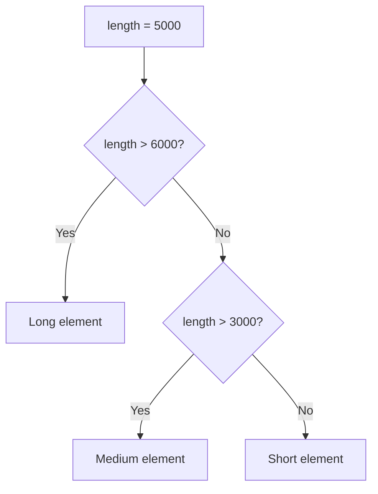
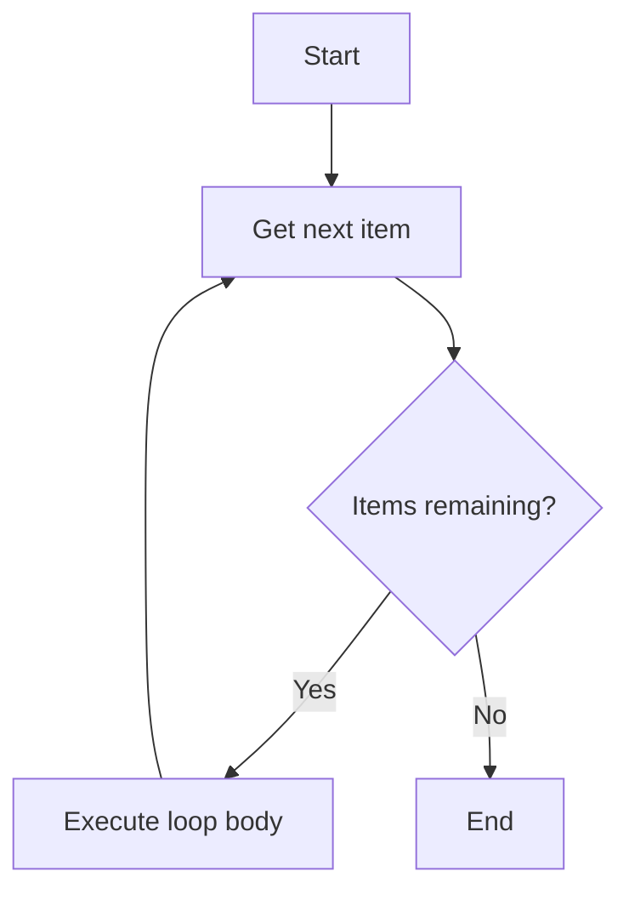

# Control Flow

Control flow statements let you execute code conditionally or repeatedly.

## If / Else



```python
length = 5000

if length > 6000:
    print("Long element")
elif length > 3000:
    print("Medium element")
else:
    print("Short element")
```

## For Loops



Iterate over sequences:

```python
materials = ["GL24h", "C24", "BSH"]

for material in materials:
    print(f"Material: {material}")
```

Iterate with index using `enumerate`:

```python
for i, material in enumerate(materials):
    print(f"{i}: {material}")
```

## While Loops

```python
count = 0
while count < 5:
    print(count)
    count += 1
```

## List Comprehensions

A concise way to create lists:

```python
lengths = [1000, 2500, 5000, 7500]
long_elements = [l for l in lengths if l > 3000]
print(long_elements)  # [5000, 7500]
```

!!! warning
    Be careful with `while` loops — ensure the condition eventually becomes `False` to avoid infinite loops.
