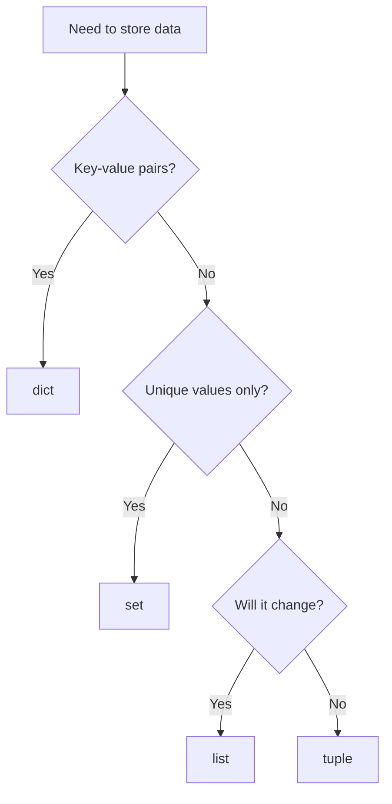

# Data Structures

Python ships with four built-in container types that cover almost every day-to-day task: **list**, **tuple**, **set**, and **dict**. Picking the right one matters — each has different strengths for storage, lookup, and mutation.


## Overview

| Structure | Ordered | Mutable | Duplicates | Lookup | Typical Use |
|-----------|---------|---------|------------|--------|-------------|
| `list`    | Yes     | Yes     | Yes        | O(n)   | Ordered collection that changes over time |
| `tuple`   | Yes     | No      | Yes        | O(n)   | Fixed record, coordinates, return multiple values |
| `set`     | No      | Yes     | No         | O(1)   | Membership tests, removing duplicates |
| `dict`    | Yes*    | Yes     | Keys: No   | O(1)   | Key-value mapping, named fields |

\* Dictionaries preserve insertion order since Python 3.7.

!!! question "Quick Check: Pick the structure"
    Which built-in type fits best for each scenario?

    1. A 3D coordinate `(x, y, z)` that should never be changed
    2. The set of distinct material codes used in a project
    3. The geometric properties of a beam (width, height, length, material)
    4. The ordered history of edits the user made

    ??? success "Show answer"
        1. `tuple` — fixed size, immutable, perfect for coordinates.
        2. `set` — automatically deduplicates and offers O(1) lookups.
        3. `dict` — named fields read better than positional values.
        4. `list` — ordered, mutable, supports `append`.

## Lists

Ordered, mutable sequences — the workhorse for collections of elements.

**Advantages**

- Keeps insertion order
- Fast append and index access
- Supports slicing and comprehensions


```python
elements = ["beam", "panel", "column"]

elements.append("plate")          # add to end
elements.insert(0, "foundation")  # add at position
elements.remove("panel")          # remove by value
last = elements.pop()             # remove and return last
elements.sort()                   # sort in place
elements.reverse()                # reverse in place
count = elements.count("beam")    # how many times it appears
idx = elements.index("column")    # first position of value
```

!!! tip
    Use a **list comprehension** instead of `append` in a loop when building a new list:
    `long_beams = [e for e in elements if e.length > 3000]`

!!! question "Quick Check: List mutation"
    What is the final value of `items`?

    ```python
    items = ["beam", "panel", "column"]
    items.insert(1, "plate")
    items.remove("panel")
    items.append("wall")
    ```

    ??? success "Show answer"
        `["beam", "plate", "column", "wall"]`

        Step-by-step:

        1. `insert(1, "plate")` → `["beam", "plate", "panel", "column"]`
        2. `remove("panel")` → `["beam", "plate", "column"]`
        3. `append("wall")` → `["beam", "plate", "column", "wall"]`

## Tuples

Ordered, **immutable** sequences. Once created, they cannot be changed.

**Advantages**

- Safe to use as dictionary keys or set members
- Slightly faster and smaller than lists
- Signals intent: "this grouping will not change"


```python
point = (1200.0, 500.0, 2500.0)   # x, y, z coordinate
x, y, z = point                    # tuple unpacking

dimensions = (120, 240, 5000)      # width, height, length
print(dimensions[2])               # 5000

# Returning multiple values from a function
def bounding_box():
    return (0, 0, 0), (6000, 240, 120)

start, end = bounding_box()
```

Useful methods:

```python
point.count(0)   # how many zeros
point.index(500) # position of value
```

!!! question "Quick Check: Tuple immutability"
    Which of these lines will raise an error?

    ```python
    point = (1200.0, 500.0, 2500.0)
    a = point[0]               # 1
    b = point + (0.0,)         # 2
    point[0] = 0               # 3
    point = (0, 0, 0)          # 4
    ```

    ??? success "Show answer"
        Only **line 3** raises `TypeError: 'tuple' object does not support item assignment`.

        - Line 2 creates a **new** tuple by concatenation — the original is untouched.
        - Line 4 just rebinds the name `point` to a different tuple — also fine.
        - Immutability means the tuple's *contents* can't change, not that the *variable* is frozen.

## Sets

Unordered collections of **unique** elements. Built for fast membership checks and set algebra.

**Advantages**

- `x in my_set` is O(1) — much faster than a list for large data
- Automatically removes duplicates
- Native union / intersection / difference operations


```python
materials = {"GL24h", "C24", "BSH"}

materials.add("GL28h")
materials.discard("C24")     # remove if present, no error if missing
materials.remove("BSH")      # remove, raises KeyError if missing

# Deduplicate a list
names = ["beam", "panel", "beam", "column", "panel"]
unique = set(names)          # {"beam", "panel", "column"}

# Set algebra
structural = {"GL24h", "GL28h", "BSH"}
in_stock   = {"GL24h", "C24"}

structural & in_stock        # intersection -> {"GL24h"}
structural | in_stock        # union        -> {"GL24h", "GL28h", "BSH", "C24"}
structural - in_stock        # difference   -> {"GL28h", "BSH"}
```

!!! question "Quick Check: Set algebra in practice"
    You have two sets:

    ```python
    needed   = {"GL24h", "GL28h", "C24"}
    in_stock = {"GL24h", "C24", "BSH"}
    ```

    Which set operation answers each question?

    1. Which needed materials are missing from stock?
    2. Which materials are in stock but not needed (could be returned)?
    3. Which materials we have *and* need?

    ??? success "Show answer"
        1. `needed - in_stock` → `{"GL28h"}`
        2. `in_stock - needed` → `{"BSH"}`
        3. `needed & in_stock` → `{"GL24h", "C24"}`

        Set difference is **not** symmetric: `A - B` is different from `B - A`.

## Dictionaries

Key-value mappings — think of them as named fields or a lookup table.

**Advantages**

- O(1) lookup by key
- Clear, self-documenting code (`beam["material"]` beats `beam[3]`)
- Flexible: values can be any type, including nested dicts or lists


```python
beam = {
    "width": 120,
    "height": 240,
    "length": 5000,
    "material": "GL24h",
}

beam["volume"] = beam["width"] * beam["height"] * beam["length"]  # add key
beam.update({"material": "GL28h", "treatment": "planed"})         # bulk update
material = beam.get("material", "unknown")                        # safe lookup
removed = beam.pop("treatment")                                   # remove & return

# Iteration
for key, value in beam.items():
    print(f"{key}: {value}")

list(beam.keys())    # all keys
list(beam.values())  # all values
```

!!! tip
    Use `dict.get(key, default)` when a key may be missing — it avoids `KeyError` and makes default values explicit.

!!! question "Quick Check: `[]` vs. `.get()`"
    What does each of these print, given the dictionary below?

    ```python
    beam = {"width": 120, "height": 240, "length": 5000}

    print(beam["length"])              # 1
    print(beam.get("length"))          # 2
    print(beam.get("treatment"))       # 3
    print(beam.get("treatment", "—"))  # 4
    print(beam["treatment"])           # 5
    ```

    ??? success "Show answer"
        1. `5000`
        2. `5000`
        3. `None`
        4. `—`
        5. **Raises `KeyError: 'treatment'`** — the program crashes here.

        Use `[]` when the key must exist; use `.get()` when it might not.

## Choosing the right structure



!!! note
    These four structures can be combined freely — a list of dicts is a common way to represent a table of elements, and a dict of sets works well for grouping. Pick the structure that matches how you will **access** the data, not just how you will **store** it.

## Wrap-up Exercise

!!! question "Mini exercise: Element catalog"
    You receive this list of beams:

    ```python
    beams = [
        {"name": "B-01", "material": "GL24h", "length": 5000},
        {"name": "B-02", "material": "GL28h", "length": 3000},
        {"name": "B-03", "material": "GL24h", "length": 7000},
        {"name": "B-04", "material": "C24",   "length": 2500},
    ]
    ```

    Write expressions that produce:

    1. The set of distinct materials used.
    2. A list of names of beams longer than 4000 mm.
    3. The total length of all beams combined.

    ??? success "Show answer"
        ```python
        materials = {b["material"] for b in beams}
        # {"GL24h", "GL28h", "C24"}

        long_names = [b["name"] for b in beams if b["length"] > 4000]
        # ["B-01", "B-03"]

        total = sum(b["length"] for b in beams)
        # 17500
        ```

        Notice the **set comprehension** in (1), **list comprehension** with filter in (2), and **generator expression** passed to `sum` in (3).
