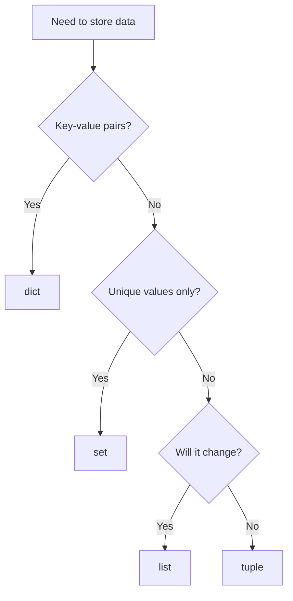

# Data Structures

Python ships with four built-in container types that cover almost every day-to-day task: **list**, **tuple**, **set**, and **dict**. Picking the right one matters — each has different strengths for storage, lookup, and mutation.

## Overview

| Structure | Ordered | Mutable | Duplicates | Lookup | Typical Use |
|-----------|---------|---------|------------|--------|-------------|
| `list`    | Yes     | Yes     | Yes        | O(n)   | Ordered collection that changes over time |
| `tuple`   | Yes     | No      | Yes        | O(n)   | Fixed record, coordinates, return multiple values |
| `set`     | No      | Yes     | No         | O(1)   | Membership tests, removing duplicates |
| `dict`    | Yes*    | Yes     | Keys: No   | O(1)   | Key-value mapping, named fields |

\* Dictionaries preserve insertion order since Python 3.7.

## Lists

Ordered, mutable sequences — the workhorse for collections of elements.

**Advantages**

- Keeps insertion order
- Fast append and index access
- Supports slicing and comprehensions

```python
elements = ["beam", "panel", "column"]

elements.append("plate")          # add to end
elements.insert(0, "foundation")  # add at position
elements.remove("panel")          # remove by value
last = elements.pop()             # remove and return last
elements.sort()                   # sort in place
elements.reverse()                # reverse in place
count = elements.count("beam")    # how many times it appears
idx = elements.index("column")    # first position of value
```

!!! tip
    Use a **list comprehension** instead of `append` in a loop when building a new list:
    `long_beams = [e for e in elements if e.length > 3000]`

## Tuples

Ordered, **immutable** sequences. Once created, they cannot be changed.

**Advantages**

- Safe to use as dictionary keys or set members
- Slightly faster and smaller than lists
- Signals intent: "this grouping will not change"

```python
point = (1200.0, 500.0, 2500.0)   # x, y, z coordinate
x, y, z = point                    # tuple unpacking

dimensions = (120, 240, 5000)      # width, height, length
print(dimensions[2])               # 5000

# Returning multiple values from a function
def bounding_box():
    return (0, 0, 0), (6000, 240, 120)

start, end = bounding_box()
```

Useful methods:

```python
point.count(0)   # how many zeros
point.index(500) # position of value
```

## Sets

Unordered collections of **unique** elements. Built for fast membership checks and set algebra.

**Advantages**

- `x in my_set` is O(1) — much faster than a list for large data
- Automatically removes duplicates
- Native union / intersection / difference operations

```python
materials = {"GL24h", "C24", "BSH"}

materials.add("GL28h")
materials.discard("C24")     # remove if present, no error if missing
materials.remove("BSH")      # remove, raises KeyError if missing

# Deduplicate a list
names = ["beam", "panel", "beam", "column", "panel"]
unique = set(names)          # {"beam", "panel", "column"}

# Set algebra
structural = {"GL24h", "GL28h", "BSH"}
in_stock   = {"GL24h", "C24"}

structural & in_stock        # intersection -> {"GL24h"}
structural | in_stock        # union        -> {"GL24h", "GL28h", "BSH", "C24"}
structural - in_stock        # difference   -> {"GL28h", "BSH"}
```

## Dictionaries

Key-value mappings — think of them as named fields or a lookup table.

**Advantages**

- O(1) lookup by key
- Clear, self-documenting code (`beam["material"]` beats `beam[3]`)
- Flexible: values can be any type, including nested dicts or lists

```python
beam = {
    "width": 120,
    "height": 240,
    "length": 5000,
    "material": "GL24h",
}

beam["volume"] = beam["width"] * beam["height"] * beam["length"]  # add key
beam.update({"material": "GL28h", "treatment": "planed"})         # bulk update
material = beam.get("material", "unknown")                        # safe lookup
removed = beam.pop("treatment")                                   # remove & return

# Iteration
for key, value in beam.items():
    print(f"{key}: {value}")

list(beam.keys())    # all keys
list(beam.values())  # all values
```

!!! tip
    Use `dict.get(key, default)` when a key may be missing — it avoids `KeyError` and makes default values explicit.

## Choosing the right structure



!!! note
    These four structures can be combined freely — a list of dicts is a common way to represent a table of elements, and a dict of sets works well for grouping. Pick the structure that matches how you will **access** the data, not just how you will **store** it.
