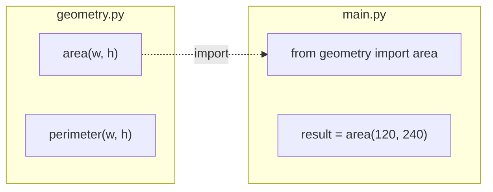

# Functions

Functions let you organize code into reusable blocks.


## Defining a Function

```python
def calculate_volume(width, height, length):
    """Calculate the volume of a rectangular element."""
    return width * height * length

volume = calculate_volume(120, 240, 5000)
print(f"Volume: {volume} mm³")
```

!!! question "Quick Check: Positional vs. keyword arguments"
    Given `calculate_volume(width, height, length)`, which of these calls produce the same result?

    ```python
    a = calculate_volume(120, 240, 5000)
    b = calculate_volume(240, 120, 5000)
    c = calculate_volume(length=5000, width=120, height=240)
    d = calculate_volume(120, length=5000, height=240)
    ```

    ??? success "Show answer"
        `a`, `c`, and `d` all return `144_000_000`. `b` returns the same number too — because multiplication is commutative — but the **meaning** is wrong (width and height are swapped).

        Key idea: positional arguments rely on order, keyword arguments rely on names. Mixing both is fine, but every positional must come **before** any keyword.

## Default Parameters

```python
def greet(name, greeting="Hello"):
    return f"{greeting}, {name}!"

print(greet("cadwork"))          # Hello, cadwork!
print(greet("cadwork", "Hi"))    # Hi, cadwork!
```

!!! question "Quick Check: The mutable default trap"
    What does this print? Most people get it wrong on the first try.

    ```python
    def add_tag(tag, tags=[]):
        tags.append(tag)
        return tags

    print(add_tag("structural"))
    print(add_tag("visible"))
    ```

    ??? success "Show answer"
        ```
        ["structural"]
        ["structural", "visible"]
        ```

        **Why:** The default value `[]` is created **once**, when the function is defined — and reused across every call that doesn't pass `tags`. The same list keeps growing.

        **Fix:** use `None` as a sentinel:

        ```python
        def add_tag(tag, tags=None):
            if tags is None:
                tags = []
            tags.append(tag)
            return tags
        ```

        Rule of thumb: **never** use a mutable object (`list`, `dict`, `set`) as a default value.

## Returning Multiple Values

```python
def min_max(values):
    return min(values), max(values)

lowest, highest = min_max([100, 250, 50, 400])
print(f"Min: {lowest}, Max: {highest}")
```

!!! question "Quick Check: What is actually returned?"
    The function appears to return *two* values. What's the real return type?

    ??? success "Show answer"
        It returns **one** `tuple` with two elements. The line `return min(values), max(values)` is syntactic sugar for `return (min(values), max(values))`.

        The receiving side uses **tuple unpacking** to split it into `lowest` and `highest`. You could also write:

        ```python
        result = min_max([100, 250, 50, 400])
        print(result)         # (50, 400)
        print(type(result))   # <class 'tuple'>
        ```

## Modules and Imports

Python code can be organized into modules:



```python
# geometry.py
def area(width, height):
    return width * height

# main.py
from geometry import area

result = area(120, 240)
```

!!! tip
    Keep functions small and focused on a single task. This makes your code easier to read, test, and reuse.

## Wrap-up Exercise

!!! question "Mini exercise: Write a function"
    Write a function `summarize(elements)` that takes a list of beam dicts (like below) and returns a tuple `(count, total_length, materials)` where `materials` is the set of distinct material codes.

    ```python
    elements = [
        {"name": "B-01", "material": "GL24h", "length": 5000},
        {"name": "B-02", "material": "GL28h", "length": 3000},
        {"name": "B-03", "material": "GL24h", "length": 7000},
    ]
    # summarize(elements) -> (3, 15000, {"GL24h", "GL28h"})
    ```

    ??? success "Show answer"
        ```python
        def summarize(elements):
            count = len(elements)
            total_length = sum(e["length"] for e in elements)
            materials = {e["material"] for e in elements}
            return count, total_length, materials

        count, total, mats = summarize(elements)
        ```

        One-liner alternative:

        ```python
        def summarize(elements):
            return (
                len(elements),
                sum(e["length"] for e in elements),
                {e["material"] for e in elements},
            )
        ```
