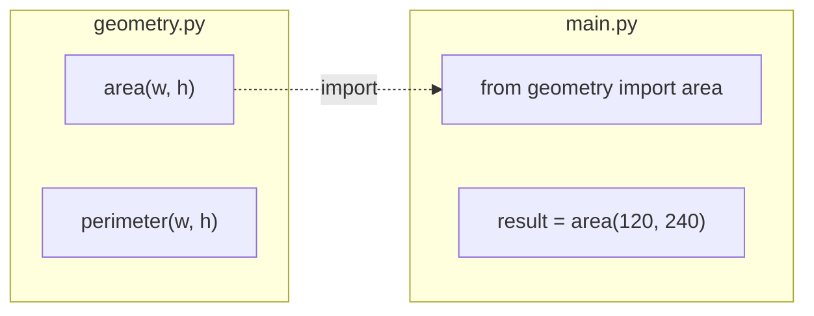

# Functions

Functions let you organize code into reusable blocks.

## Defining a Function

```python
def calculate_volume(width, height, length):
    """Calculate the volume of a rectangular element."""
    return width * height * length

volume = calculate_volume(120, 240, 5000)
print(f"Volume: {volume} mm³")
```

## Default Parameters

```python
def greet(name, greeting="Hello"):
    return f"{greeting}, {name}!"

print(greet("cadwork"))          # Hello, cadwork!
print(greet("cadwork", "Hi"))    # Hi, cadwork!
```

## Returning Multiple Values

```python
def min_max(values):
    return min(values), max(values)

lowest, highest = min_max([100, 250, 50, 400])
print(f"Min: {lowest}, Max: {highest}")
```

## Modules and Imports

Python code can be organized into modules:



```python
# geometry.py
def area(width, height):
    return width * height

# main.py
from geometry import area

result = area(120, 240)
```

!!! tip
    Keep functions small and focused on a single task. This makes your code easier to read, test, and reuse.
