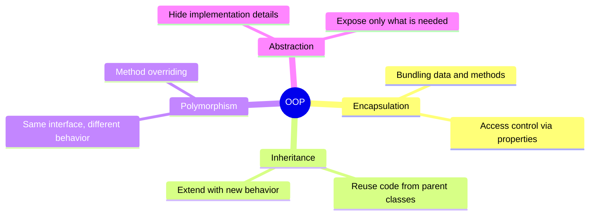
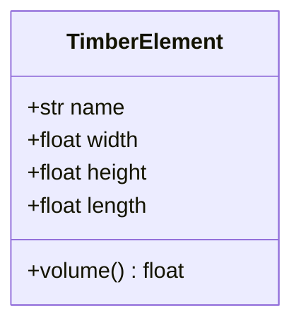
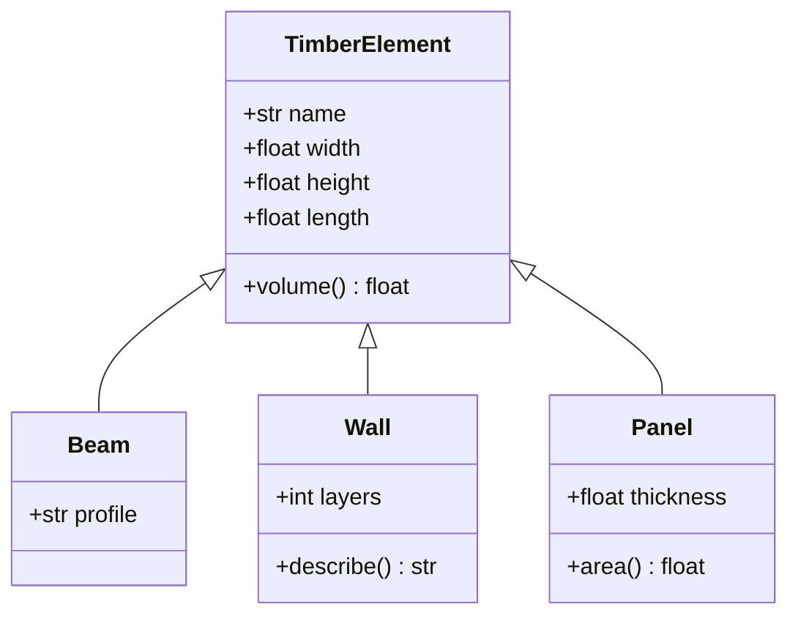
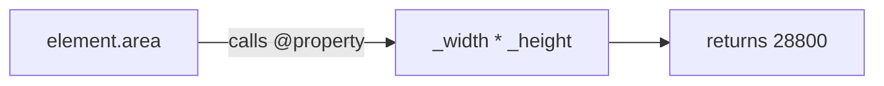
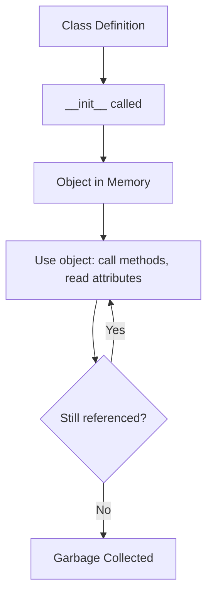

# Object-Oriented Programming

Object-oriented programming (OOP) organizes code around objects that combine data and behavior.


## Core Concepts

The following diagram shows the four pillars of OOP:



## Classes and Objects

A **class** is a blueprint. An **object** is an instance of that class.



```python
class TimberElement:
    def __init__(self, name, width, height, length):
        self.name = name
        self.width = width
        self.height = height
        self.length = length

    def volume(self):
        return self.width * self.height * self.length

beam = TimberElement("Beam_01", 120, 240, 5000)
print(f"{beam.name}: {beam.volume()} mm³")
```

## Inheritance

A child class inherits attributes and methods from its parent and can add or override them.



```python
class Wall(TimberElement):
    def __init__(self, name, width, height, length, layers):
        super().__init__(name, width, height, length)
        self.layers = layers

    def describe(self):
        return f"{self.name} with {self.layers} layers"

wall = Wall("Wall_01", 160, 2800, 6000, 3)
print(wall.describe())
print(wall.volume())
```

## Properties

Properties provide controlled access to attributes — this is **encapsulation** in practice.



```python
class Element:
    def __init__(self, width, height):
        self._width = width
        self._height = height

    @property
    def area(self):
        return self._width * self._height

element = Element(120, 240)
print(element.area)  # 28800
```

## Object Lifecycle



