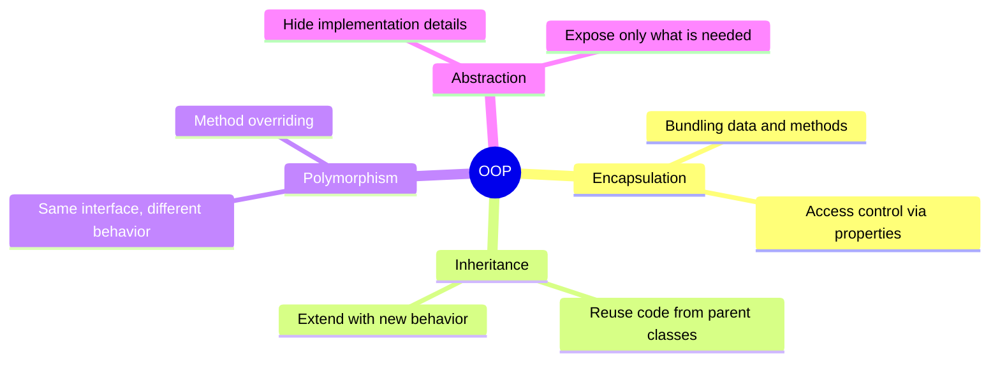
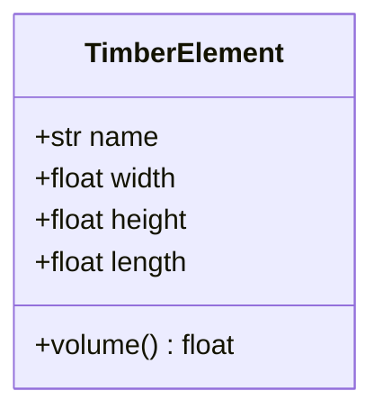
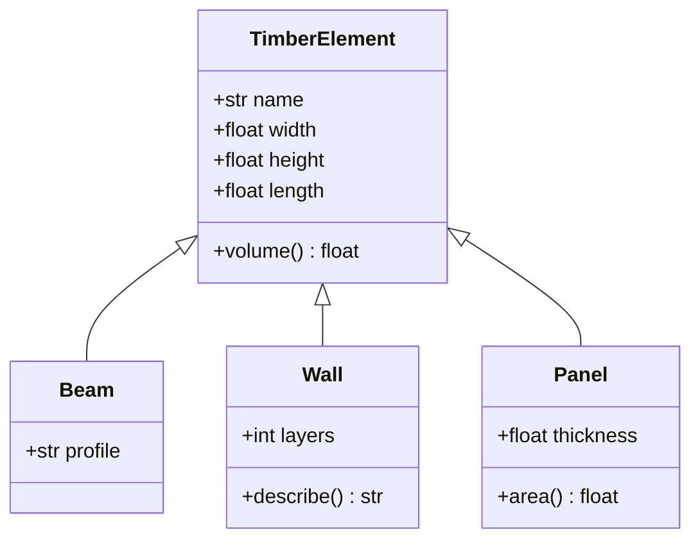
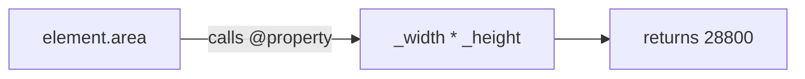
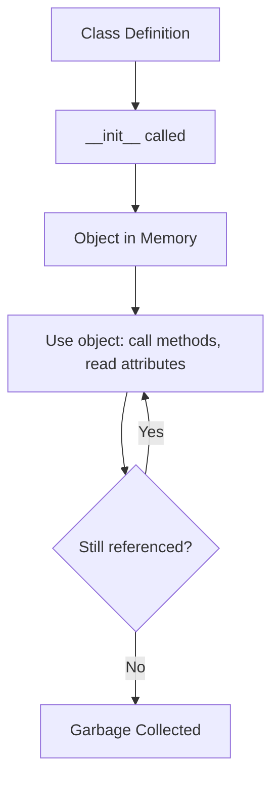

# Object-Oriented Programming

Object-oriented programming (OOP) organizes code around objects that combine data and behavior.


## Core Concepts

The following diagram shows the four pillars of OOP:



## Classes and Objects

A **class** is a blueprint. An **object** is an instance of that class.



```python
class TimberElement:
    def __init__(self, name, width, height, length):
        self.name = name
        self.width = width
        self.height = height
        self.length = length

    def volume(self):
        return self.width * self.height * self.length

beam = TimberElement("Beam_01", 120, 240, 5000)
print(f"{beam.name}: {beam.volume()} mm³")
```

!!! question "Quick Check: What is `self`?"
    Two beams are created:

    ```python
    b1 = TimberElement("B-01", 120, 240, 5000)
    b2 = TimberElement("B-02", 100, 200, 3000)
    print(b1.volume(), b2.volume())
    ```

    Why does `b1.volume()` return the volume of `B-01` and not `B-02`, even though both call the same method?

    ??? success "Show answer"
        Because `b1.volume()` is equivalent to `TimberElement.volume(b1)` — Python passes the instance as the first argument, which we name `self`. Inside the method, `self.width` reads the attribute on **that specific instance**.

        Output: `144000000 60000000`.

        Forgetting `self` (e.g. `def volume(): return self.width * ...`) is a classic beginner error and raises `TypeError: volume() takes 0 positional arguments but 1 was given`.

## Inheritance

A child class inherits attributes and methods from its parent and can add or override them.



```python
class Wall(TimberElement):
    def __init__(self, name, width, height, length, layers):
        super().__init__(name, width, height, length)
        self.layers = layers

    def describe(self):
        return f"{self.name} with {self.layers} layers"

wall = Wall("Wall_01", 160, 2800, 6000, 3)
print(wall.describe())
print(wall.volume())
```

!!! question "Quick Check: Why `super().__init__`?"
    What happens if you forget the `super().__init__(...)` call in `Wall.__init__`?

    ??? success "Show answer"
        The parent's `__init__` never runs, so `self.name`, `self.width`, `self.height`, and `self.length` are **never set**. Calling `wall.volume()` then raises `AttributeError: 'Wall' object has no attribute 'width'`.

        `super().__init__(...)` delegates the parent-class setup to the parent's constructor, so the child only has to add what's new (here: `self.layers`). It's the cleanest way to extend a class without duplicating the parent's initialization code.

!!! question "Quick Check: Predict the output"
    Given the classes above, what does this print?

    ```python
    wall = Wall("W-01", 160, 2800, 6000, 3)
    print(wall.length)
    print(isinstance(wall, TimberElement))
    ```

    ??? success "Show answer"
        ```
        6000
        True
        ```

        - `wall.length` was set by `super().__init__` — inheritance means a `Wall` *is a* `TimberElement` and has all its attributes.
        - `isinstance(wall, TimberElement)` is `True` because `Wall` inherits from `TimberElement`. `isinstance` walks the inheritance chain.

## Properties

Properties provide controlled access to attributes — this is **encapsulation** in practice.



```python
class Element:
    def __init__(self, width, height):
        self._width = width
        self._height = height

    @property
    def area(self):
        return self._width * self._height

element = Element(120, 240)
print(element.area)  # 28800
```

!!! question "Quick Check: Property vs. method"
    Why is `element.area` written **without** parentheses, but `beam.volume()` from the earlier example **with** parentheses?

    ??? success "Show answer"
        `area` is a **property** — the `@property` decorator turns the method into an attribute-style accessor. From the outside it looks like data, even though it's computed every time.

        `volume` is a regular **method** — it needs to be called explicitly with `()`.

        Use `@property` when the access *feels* like reading a value (no side effects, cheap to compute). Use a method when there is real work, parameters, or noticeable cost involved.

## Object Lifecycle



## Wrap-up Exercise

!!! question "Mini exercise: Add a Panel class"
    Extend the example by writing a `Panel` class that:

    - inherits from `TimberElement`
    - adds a `thickness` attribute (instead of `width`)
    - overrides `volume()` to use `thickness * length * height`
    - adds an `area` **property** that returns `length * height`

    ??? success "Show answer"
        ```python
        class Panel(TimberElement):
            def __init__(self, name, thickness, height, length):
                super().__init__(name, thickness, height, length)
                self.thickness = thickness

            def volume(self):
                return self.thickness * self.length * self.height

            @property
            def area(self):
                return self.length * self.height

        panel = Panel("P-01", 40, 2800, 6000)
        print(panel.volume())   # 672_000_000
        print(panel.area)       # 16_800_000
        ```

        Note how `volume()` **overrides** the parent's implementation — same name, different formula. This is polymorphism in action: callers don't need to know whether they hold a `Panel`, `Wall`, or generic `TimberElement` — they just call `.volume()`.

